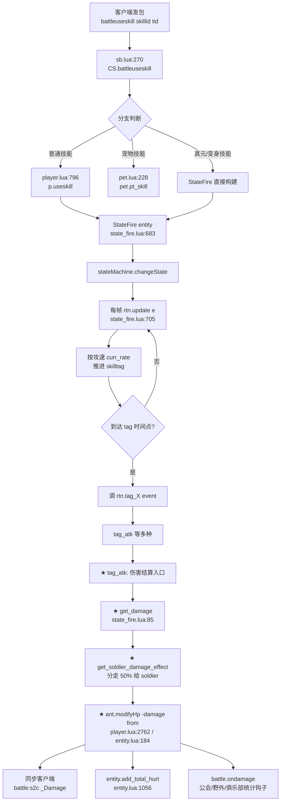
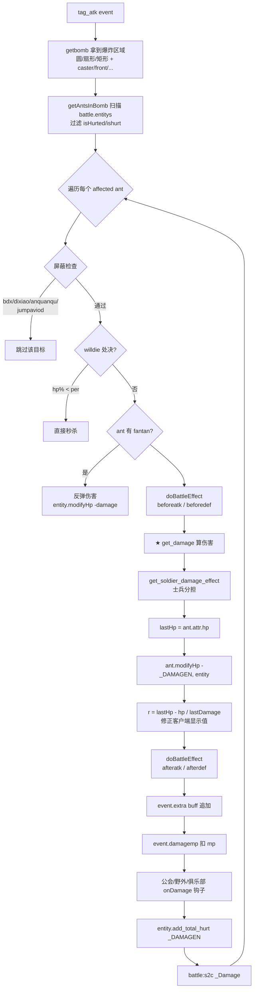
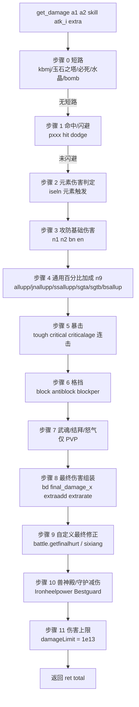
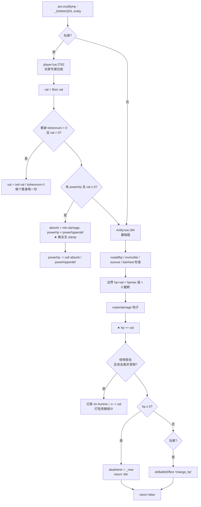
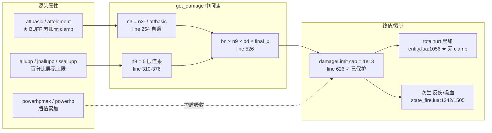
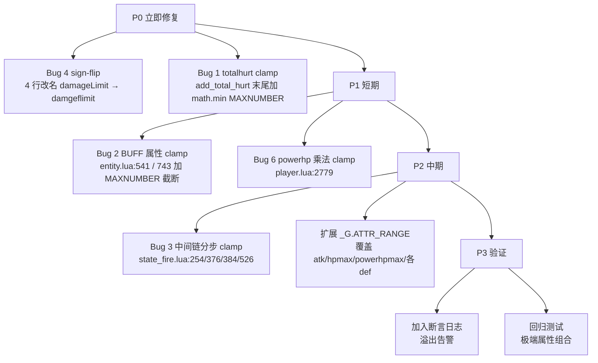
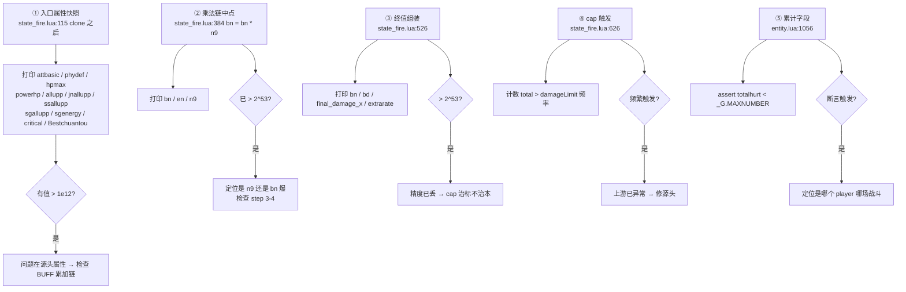

# 玩家伤害数值溢出分析报告

> **项目约束**：底层 C++ 用 IEEE 754 double 存储数值，整数精确表示上限为 **2^53 ≈ 9.007 × 10¹⁵**（约 16 位十进制位）。任何数值不可超过 54bit。
>
> **目标**：定位项目中可能突破该上限的玩家伤害链路代码，给出修复方向。
>
> **作用域**：以 Lua 战斗主路径为主（`state_fire.lua` / `entity.lua` / `player.lua` / `battleeffect.lua` / `diybufffunc.lua` / `shield.lua`），不涉及客户端/底层 C++。

---

## 目录

- [1. 项目已有的数值保护](#1-项目已有的数值保护)
- [2. 战斗链路总览](#2-战斗链路总览)
- [3. 伤害计算公式 `get_damage` 详解](#3-伤害计算公式-get_damage-详解)
- [4. 扣血链路 `modifyHp`](#4-扣血链路-modifyhp)
- [5. 关键属性字段表](#5-关键属性字段表)
- [6. 已发现的溢出风险点](#6-已发现的溢出风险点)
- [7. 修复建议](#7-修复建议)
- [8. 排查抓手](#8-排查抓手)

---

## 1. 项目已有的数值保护

| 位置 | 常量 / 函数 | 数值 | 使用情况 |
|---|---|---|---|
| `common.lua:3` | `_G.MAXNUMBER` | `9_000_000_000_000_000` (9×10¹⁵) | 已定义但**只**被以下文件引用 |
| `diybufffunc.lua:5-16` | `limitMax(num)` | 用 MAXNUMBER 截断 | 仅飞羽化 buff 4 处 |
| `cs_arena.lua:328` | clamp 入口 | MAXNUMBER | 竞技场积分 |
| `cs_month_rank.lua:751` | clamp 入口 | MAXNUMBER | 月度排行 |
| `cs_tujian.lua:595/627/634` | clamp 入口 | MAXNUMBER | 图鉴排行 |
| `dsm/dsm_club.lua:67` | clamp 入口 | MAXNUMBER | 公会总战力 |
| `state_fire.lua:70 / 626` | `damageLimit` | `9_999_999_999_999` (≈10¹³) | get_damage 终值，远低于 MAXNUMBER |

**问题：** 上限保护贴在排行榜、积分、飞羽化等 9 个外围点，**战斗主路径**（属性 buff 叠加、伤害公式中间计算、累计伤害字段）**完全不引用** `_G.MAXNUMBER`。

---

## 2. 战斗链路总览

### 2.1 总体链路（客户端按键 → 目标扣血）



### 2.2 `tag_atk` 内部流程（state_fire.lua:1185）



---

## 3. 伤害计算公式 `get_damage` 详解

> 文件：`state_fire.lua:85-658`
>
> 设 `attr1` = 攻击者属性，`attr2` = 受击者属性。整套公式按"基础伤害 → 全局加成 → 暴击 → 格挡 → 怒气 → 最终修正 → 上限"逐层乘出。

### 3.1 公式分层流程图



### 3.2 各步公式

#### 步骤 0 — 短路 / 特殊伤害 (line 87-120)

| 条件 | 返回 |
|---|---|
| 玩家打怪 + tag == 'kbmj' | `get_damage_kbmj(...)` (line 33-82 另一条公式) |
| `battle.caty == 'jadetower'` | `battle:fixedDamage(...)` |
| `a2.mustDamageN(a1)` 返回值 | 必死伤害 |
| 玩家变身打怪 (非 holylight) | `nil, 0` |
| 怪打水晶 | boss = 500，普通 = 100 |
| a1 是 bomb/blob | `hpmax × (hurtrates[who] - downrate)` |

#### 步骤 1 — 命中/闪避 (line 156-188)

```
pxxx = 战力比修正
    a1.power / a2.power > 1: pxxx = min(1 + (ratio-1)*0.6, 1.6)
    a1.power / a2.power < 1: pxxx = max(1 - (1-ratio)*0.6, 0.5)
    其它:                    pxxx = 1

dodge = attr2.dodge × (1 + 职业_dodge/100 + tag_dodge/100)
hit1  = attr1.hit   × (1 + 职业_hit/100   + tag_hit/100)

血量 > 70%:   hit1 *= 1 + mzzj/100
觉醒 awakenwssb (概率 35%): dodge *= (100 - awakenwssb)/100
觉醒 awakenwsmz (概率 35%): hit1  *= (100 - awakenwsmz)/100

if random(100) < ceil((dodge/pxxx - hit1) / (dodge + 30000) × 100):
    return {v=0, c="shanbi"}, 0
```

#### 步骤 2 — 元素触发 (line 190)

```
iseln = random(1,100) <= skill.erate × (1 + attr1.erateup - attr2.eratedown)
```

#### 步骤 3 — 攻防基础伤害 (line 200-269)

对 `skill.damage` 的每个伤害项 `k`（`phy/mag/flame/frozen/thunder/toxin`）循环：

```
att_k    = phy/mag → 'attbasic';  元素 → 'attelement'
def_k    = 对应防御键
elementdamage = attr1.elementdamage     (仅元素)
elementdefper = attr2.elementdefper     (按 elementdefposs 概率)

# 觉醒影响
awakenwsfy/yk (35%): attr2.[*]def *= (100 - awakenwsfy)/100
awakenwsgj/ys (35%): attr1.att*   *= (100 - awakenwsgj)/100

defkattr = max(attr2[def_k], 0)

# ★ 关键公式
n3 = attr1[att_k] × (1 + elementdamage/100)
   - defkattr × (100 - attr1.ignore + elementdefper)/100 × (1 + jiebai)
n3 = max(0, n3)
n3 = n3 × n3 / attr1[att_k] × pxxx     ← ★ 自乘后除，n3² 易溢出
n1 = max(attr1[att_k] × 0.02, n3)

n2 = max(0, (attr1[att_up] + attr_x + 100 - attr2[def_down] + gdfjsh)/100)

if 元素:   en += n1 × v/100 × n2 + 1
else:      bn += n1 × v/100 × n2 + 1

bn  = (bn + skill.damage.extra  + skill_attr_x.extra)  × dx
en  = (en + skill.damage.extrae + skill_attr_x.extrae) × dx

if 有元素: en *= max(1 + elementsup/100 - elementsdown/100, 0.01)
```

> ⚠️ **`n3 = n3 × n3 / attr1[att_k]`**：若 `n3` 已达 1e8，平方就是 1e16，**直接突破 2^53**。

#### 步骤 4 — 通用百分比加成 n9 (line 280-386)

```
# 狂暴 / 见血如雷
n8 = costhp1% × kuangbao - costhp2% × jian1ren4

# 宠物加成（仅 a1 是 pet）
petjc = red6petzs + redpetzs + orangepetzs (各自带概率倍率)

# 全局加成 ① allupp
allupp   = attr1.allupp + 职业_allupp + tag_allupp + petjc + 荣耀锦标赛 genre_allupp
alldownp = attr2.alldownp + 职业_alldownp + tag_alldownp + ridealldownp
若双方机甲: allupp += jjqd; alldownp += jjqd

n9 = (100 + allupp × 0.5 + attr_x - alldownp × 0.5 + n8) / 100

# 穿防 ② jnallupp + Bestchuantou/Bestdunshan
if 玩家攻 且 Bestchuantou ≥ Bestdunshan:
    分支 1 未破防: 复杂衰减公式
        new_jnallupp ∈ (0, 1]
    分支 2 破防:
        new_jnallupp = 1 + (jnallupp - jnalldownp)*0.5 + (Bestchuantou - Bestdunshan)/100
    n9 *= new_jnallupp
else:
    n9 *= (100 + jnallupp*0.5 - jnalldownp*0.5) / 100

# 兽神 ③ ssallupp
n9 *= (100 + ssallupp*0.5 - ssalldownp*0.5) / 100

# 四象 ④ sgta / sgtb
sgta = max((sgallupp - sgalldownp)/100, -1)
if sgta > 1: sgta = ceil(sqrt(sgta) × 100)/100   ← 超 1 时取根号
sgta = 1 + sgta

sgtb = (sgenergy_atk - sgenergy_def) / 1000
按战力比 power_ratio 修正
sgtb = 1 + sgtb;  sgtb = max(sgtb, 0)

n9 *= sgta × sgtb

# 变身阵营 ⑤
bsallup    = bs_<atk_zy>_<def_zy>_allupp    + attr1.alluppbs
bsalldownp = bs_<atk_zy>_<def_zy>_alldownp  + attr2.alldownpbs
n9 = max(n9 × (1 + bsallup/100 - bsalldownp/100), min_fix or 0.01)

bn *= n9
en *= n9  (若元素)
```

> ⚠️ **5 层乘法链**：`n9` 经 allupp / jnallupp / ssallupp / (sgta×sgtb) / bsallup 五连乘，任何一层失控都会被后续放大。

#### 步骤 5 — 暴击 (line 392-445)

```
若 skill.index == 1: bs = ptgjbs, isbj = random(100) < ptgjbj

tough1, criticalage1 = attr1.tough/criticalage × (1 + 职业_/tag_)
tough2, anticriticalage2 = attr2.tough/anticriticalage × (1 + 职业_/tag_)
critical = attr1.critical × (1 + 职业_critical + tag_critical) / 100

残血加成:
  costhp1 < 0.3 → criticalage1 += bszj
  costhp2 < 0.3 → anticriticalage2 += bmzj; tough2 *= 1 + rxzj/100

觉醒 awakenwsrx (35%):  tough2          *= (100 - awakenwsrx)/100
觉醒 awakenwsbj (35%):  critical        *= (100 - awakenwsbj)/100
觉醒 awakenwsbs (35%):  criticalage1    *= (100 - awakenwsbs)/100

暴击判定:
if isbj or random(100) < ceil((critical*pxxx - tough2)/(critical+50000) + attr_x) × 100:
    觉醒 awakenwsbk (35%): anticriticalage2 *= (100 - awakenwsbk)/100
    n9_crit = (150 + criticalage1 - anticriticalage2 + attr_x + bs)/100
              × (random(100) ≤ cjbj ? cjbjsh/100 + 1 : 1)
    bn *= n9_crit
    en *= n9_crit  (若元素)
```

#### 步骤 6 — 格挡 (line 446-468)

```
block    = attr2.block    × (1 + 职业_block    + tag_block)
antiblock= attr1.antiblock× (1 + 职业_antiblock + tag_antiblock)

觉醒 awakenwsgd (35%):  block     *= (100 - awakenwsgd)/100
觉醒 awakenwspd (35%):  antiblock *= (100 - awakenwspd)/100

if not hat_w_wsg and random(100) < ceil((block/pxxx - antiblock)/(block + 30000) × 100):
    blockper = 0.5
    若 attr2.blockposs 触发: blockper = 0.5 × (1 - blockper_pct/100)
    bn *= blockper;  en *= blockper
```

#### 步骤 7 — 武魂 / 结拜 / 怒气 (line 471-511)

```
wuhun_lingyu_xishu = a1.wuhun_lingyu_dmg(skill.index)       # 武魂领域
jbjiac     = cfg_jiebai.skills[2].attr[lvl].attr            # 结拜2
jbdianfeng = cfg_jiebai.skills[3].attr[lvl].attr            # 结拜3
jbbosszs   = cfg_jiebai.skills[4].attr[lvl].attr            # 野外打 boss

仅 玩家 vs 玩家:
    rate = 1
    attr1.wrath < 50: rate += fnqzs/100
    attr2.wrath < 50: rate -= fnqms/100
    attr2.wrath > 50: rate -= nqms/100
    a1 血量优势:      rate += xlyz/100  - fxljm/100
    a2 血量优势:      rate += fxlyz/100
    rate = max(rate, 0.1)
    bn *= rate;  en *= rate
```

#### 步骤 8 — 最终伤害组装 (line 513-533)

```
bd = (0.95 + random(0,10)/100) + wuhun_lingyu_xishu
   + jbjiac - jbdianfeng + jbbosszs + (a2.zengshangrate or 0)

extrarate = 1
extraadd  = 0
if extra.hpp:               extraadd += attr2.hp × extra.hpp / 100
if extra.bianshenid 匹配:    extrarate += extra.per / 100

# ★ 终值
ret[1].v = max(1, ceil((bn × bd × a1.final_damage_x
                       × (hat_w_wsg ? cjmzsh/100 + 1 : 1)
                       + extraadd) × extrarate))
ret[2].v = max(1, ceil((en × a1.final_damage_x × ...
                       + extraadd) × extrarate))
total    = ret[1].v + (ret[2].v or 0)
```

#### 步骤 9 — 自定义最终修正 (line 535-558)

```
if a1.battle.getfinalhurt:
    ret, total = a1.battle.getfinalhurt(a1, a2, ret, skill.damage.phy)
    # 例: pettowerbattle.lua:112  阵营克制 + 1/m 放大（最坏 50×）

if tag == 'sixiang' 且 双方玩家:
    newtotal = total + upbuffs[psid] × a2.attr.hpmax / 100
    newtotal = min(newtotal, (100 - downbuffs) × a2.attr.hpmax / 100)
    若 mianshang: newtotal = min(newtotal, 5% × a2.attr.hpmax)
    按比例同步 ret[1].v / ret[2].v
```

#### 步骤 10 — 兽神殿 / 守护减伤 (line 561-623)

```
# 铁蹄之力 Ironheelpower (上限 1500)
Ironheelpower = max(0, attr1.Ironheelpower - attr2.Ironheelpower)
ironheel_damage = ceil(total × Ironheelpower / 10000)
total           = ceil(total × (1 + Ironheelpower/10000))
ret[3] = {v = ironheel_damage, c = 段位标签}   # 段位: jrjf/ldjt/jfxy/zszy/jyyw/syxq
ret[1].v += ret[3].v

# 控制减伤（受击者中过控制 islastkongzhi）
shouhu1, shouhu2 = attr1.Bestguard, attr2.Bestguard
if shouhu2 > shouhu1:
    diff = shouhu2 - shouhu1
    reduction = diff / (20000 + 4 × diff)        # 渐近上限 25%
    total    -= ceil(total    × reduction)
    ret[1].v -= ceil(ret[1].v × reduction)
    ret[3].v -= ceil(ret[3].v × reduction)
```

#### 步骤 11 — 伤害上限 (line 626-658)

```
damageLimit = 9_999_999_999_999    # ≈ 1e13

# 正向 cap
if total > 0 and total > damageLimit:
    if ret[2]:
        ret[1].v = ceil(ret[1].v × damageLimit / total)
        ret[2].v = damageLimit - ret[1].v
    else:
        ret[1].v = damageLimit
    total = damageLimit

# 负向 cap (★ 写法有 sign-flip bug)
damgeflimit = -9_999_999_999_999
if total < 0 and total < damgeflimit:
    ret[1].v = ceil(ret[1].v × damageLimit / total)  # ❌ 应为 damgeflimit
    ret[2].v = damageLimit - ret[1].v                 # ❌
    ret[1].v = damageLimit                             # ❌ 负值翻正
    total = damageLimit                                # ❌

# 铁蹄 ret[3] 单独 cap
if ret[3].v > damageLimit:        ret[3].v = damageLimit
if ret[3].v < damgeflimit:        ret[3].v = damageLimit  # ❌ sign-flip

return ret, max(1, total)
```

---

## 4. 扣血链路 `modifyHp`



> ⚠️ `player.lua:2779` 的 `powerhp × powerhpperdef` 乘法是溢出热点：若 `powerhpmax` 被 BUFF 链路炸大，护盾吸收量同步失真。

---

## 5. 关键属性字段表

| 类别 | 字段 | 说明 |
|---|---|---|
| **攻防** | `attbasic` `attelement` | 物攻 / 元素攻 |
| | `phydef` `magdef` `flamedef` `frozendef` `thunderdef` `toxindef` | 各类防御 |
| | `attbasicupp` `attelementupp` `phydownp` `magdownp` … | 加/减伤百分比 |
| **全局加成** | `allupp` `alldownp` | 全伤害加成/减免 |
| **穿防** | `jnallupp` `jnalldownp` `Bestchuantou` `Bestdunshan` `ignore` | 穿透 / 盾山 / 忽视防御 |
| **兽神** | `ssallupp` `ssalldownp` | 兽神加成 |
| **四象** | `sgallupp` `sgalldownp` `sgenergy` | 四象加成与能量 |
| **暴击** | `critical` `criticalage` `criticalup` `cjbj` `cjbjsh` `ptgjbj` `ptgjbs` | 暴击/连击 |
| **抗暴** | `tough` `anticriticalage` | 韧性/抗暴倍率 |
| **命中** | `hit` `dodge` `mzzj` | 命中/闪避/残血闪避 |
| **格挡** | `block` `antiblock` `blockposs` `blockper` | 格挡 |
| **元素** | `elementdamage` `elementdefper` `elementdefposs` `elementsup` `elementsdown` `erateup` `eratedown` | 元素 |
| **残血** | `kuangbao` `jian1ren4` `bszj` `bmzj` `rxzj` `xlyz` `fxlyz` `fxljm` | 狂暴/见血如雷/残血爆击/血量优势 |
| **摸心** | `cjmz` `cjmzsh` | 摸心率/摸心增伤 |
| **觉醒** | `awakenwssb` `awakenwsmz` `awakenwsfy` `awakenwsyk` `awakenwsgj` `awakenwsys` `awakenwsbk` `awakenwsbj` `awakenwsbs` `awakenwsrx` `awakenwsgd` `awakenwspd` | 各觉醒系数 |
| **变身** | `bs_<zy>_<zy>_allupp/_alldownp` `alluppbs` `alldownpbs` `jjqd` | 变身阵营 |
| **兽神殿** | `Ironheelpower` `Bestguard` | 铁蹄/守护 |
| **怒气** | `wrath` `fnqzs` `fnqms` `nqms` | 怒气与攻防系数 |
| **宠物** | `red6petzs` `redpetzs` `orangepetzs` `red6petzsew` `redpetzsew` `orangepetzsew` `petxx` | 宠物加成/吸血 |
| **盾** | `powerhp` `powerhpmax` `powerhpperdef` `powerhpadd` `powerhpignore` | 防御盾 |
| **最终修正** | `final_damage_x` `zengshangrate` | 终值系数/受击增伤 |
| **累计** | `totalhurt` | 累计造成伤害（**无 clamp**） |
| **跨职业/场景** | `<job>_<attr>` `<tag>_<attr>` | 任意属性可按职业/场景再加层（hit/dodge/block/critical/tough/criticalage/allupp/alldownp） |

---

## 6. 已发现的溢出风险点

### 6.1 风险概览图



### 6.2 🔴 高危 Bug 清单

#### Bug 1 — 累计伤害 `totalhurt` 无上限

| 项 | 内容 |
|---|---|
| **位置** | `entity.lua:1056` `rtn.totalhurt = rtn.totalhurt + n` |
| **场景** | PVE 副本 / worldwar / club / 公会战，单次伤害最高 1e13，几十次满伤后就突破 2^53 |
| **影响** | `battle_pve.lua:246` / `battle_pve.lua:561` 用 totalhurt 算秒伤 `miaoshang = ceil(totalhurt / passed_t)`，溢出后秒伤错乱 |
| **不一致** | 排行榜代码 `cs_arena.lua:328` / `cs_tujian.lua:595` / `cs_month_rank.lua:751` / `dsm/dsm_club.lua:67` 都已用 `_G.MAXNUMBER` clamp，唯独 totalhurt 没做 |

#### Bug 2 — BUFF 属性叠加无 clamp（伤害源头爆炸）

| 项 | 内容 |
|---|---|
| **位置 A** | `entity.lua:541` `rtn.attr[attrk] = (rtn.attr[attrk] or 0) + ccc[attrk]` |
| **位置 B** | `entity.lua:536` `ccc[attrk] = math.max(_oldattr[attrk] + _oldattr[attrk] * v, 0)` (istimeup buff 每秒累加百分比) |
| **位置 C** | `entity.lua:743` `rtn.attr[attr_name] = ... + (rtn.attr[attr_name] or 0) * rtn.buffs[id].attr_num` (around_enhance) |
| **风险** | 属性溢出后，`state_fire.lua` 整套 get_damage 都失真，damageLimit 也救不回来（中间乘法链已突破 2^53 精度） |
| **核对** | `battleeffect.lua:2` 的 `limitattr` 只覆盖 `hp/mp/wrath/speed`，**没有** atk/def/hpmax 等核心属性上限 |

#### Bug 3 — 伤害公式中间值能突破 2^53（即使终值被 damageLimit 接住，精度已丢）

| 行号 | 表达式 | 风险 |
|---|---|---|
| `state_fire.lua:52` | `attbasic * (skill_rate*dx/100) * (1-all_def) * (1 + allupp/100) * (1 + jnallupp/100) * (1 + zuizhongallupp/100) * (1 + ssallupp/100) * (random/100)` | kbmj 公式 7 层乘法链 |
| `state_fire.lua:254` | `n3 = n3 * n3 / attr1[att_k]` | 自乘后除，n3² 易越界 |
| `state_fire.lua:310-386` | n9 经 allupp/jnallupp/ssallupp/(sgta×sgtb)/bsallup 五连乘 | 多层失控 |
| `state_fire.lua:526` | `ceil((bn × bd × final_damage_x × (...) + extraadd) × extrarate)` | 终值再乘 3-4 个系数 |

> **影响**：若 `attbasic` 已达 1e9（BUFF 路径完全可能），7 层倍率连乘后中间值 ≥ 1e15，Lua double 此时丢精度。后续 `damageLimit / total` 的按比例分配 `ret[1] / ret[2]`（line 629-630）也跟着失真。

### 6.3 🟡 中危 Bug 清单

#### Bug 4 — `damgeflimit` 写错变量（sign-flip）

```lua
-- state_fire.lua:638-648
local damgeflimit = -9999999999999
if total < 0 and total < damgeflimit then
    if ret[2] then
        ret[1].v = ceil(ret[1].v * damageLimit / total)   -- ❌ 应为 damgeflimit
        ret[2].v = damageLimit - ret[1].v                  -- ❌
    else
        ret[1].v = damageLimit                              -- ❌ 应为 damgeflimit
    end
    total = damageLimit                                     -- ❌ 把 -1e13 翻成 +1e13
end

-- state_fire.lua:654-656
if ret[3] and ret[3].v < 0 and ret[3].v < damgeflimit then
    ret[3].v = damageLimit                                  -- ❌ 同样 sign-flip
end
```

当前 `ret[*].v` 入口都有 `math.max(1, ...)` 兜底，**当前业务路径触发不到**；但属于潜在地雷：一旦下游修改让 total 可能为负（治疗/反伤/移除 sixiang 减伤），会把"被反弹的伤害"翻成"打出去的正伤"。

#### Bug 5 — pettowerbattle 1/m 50× 放大

```lua
-- pettowerbattle.lua:117-121
local nn = (atk - def)*(1-def/atk)
local m = atk*0.02>nn and 1 or math.max(0.02, 1-def/atk)
for k, v in next, ret do
    v.v = toint((v.v/m)*rate)        -- 最坏 v.v × 50 × rate
end
```

执行在 `state_fire.lua:536` `getfinalhurt` 之后、`state_fire.lua:626` damageLimit 之前 —— 终值会被 cap 住，但中间值可越过 2^53 导致 `toint/ceil` 精度丢失。

#### Bug 6 — powerhp（护盾）乘法无上限

| 位置 | 表达式 |
|---|---|
| `player.lua:2779` | `local absorb = math.min(damage, powerhp * rtn.attr.powerhpperdef)` |
| `shield.lua:208` | `local add = self.powerhpmax * (self.player.attr.powerhpadd / 100)` |

`powerhp` 通过 BUFF 累加（Bug 2 路径）若溢出 → 这里全失真。

#### Bug 7 — 次生伤害跟着主伤害一起炸

| 位置 | 表达式 |
|---|---|
| `state_fire.lua:1505` | `entity.master.xixue(totaldamage * entity.master.attr.petxx / 100)` (宠物吸血) |
| `state_fire.lua:1242` | `local damage = (target.attr[buff_value.buffparam.attr] or 0) * buff_value.buffparam.percent / 100` (反伤) |

`totaldamage` 一旦溢出，吸血、反伤一并失真。

---

## 7. 修复建议

### 7.1 修复优先级



### 7.2 推荐 patch 模式

**通用 clamp 工具**（建议在 `common.lua` 或 `diybufffunc.lua` 提级到全局）：

```lua
-- 整数值 clamp（保留正负号）
function _G.clampMax(num)
    if not num then return end
    if num > _G.MAXNUMBER then return _G.MAXNUMBER end
    if num < -_G.MAXNUMBER then return -_G.MAXNUMBER end
    return num
end
```

**Bug 1 — totalhurt 截断**

```lua
-- entity.lua:1052-1058
function rtn.add_total_hurt(n)
    if rtn.who == "pet" and rtn.master then
        rtn.master.add_total_hurt(n)
    else
        rtn.totalhurt = math.min(rtn.totalhurt + n, _G.MAXNUMBER)  -- ★ 新增 clamp
    end
end
```

**Bug 4 — sign-flip 修复**

```lua
-- state_fire.lua:638-648
local damgeflimit = -damageLimit
if total < 0 and total < damgeflimit then
    if ret[2] then
        ret[1].v = ceil(ret[1].v * damgeflimit / total)   -- ✓
        ret[2].v = damgeflimit - ret[1].v                  -- ✓
    else
        ret[1].v = damgeflimit                              -- ✓
    end
    total = damgeflimit                                     -- ✓
end

-- state_fire.lua:654-656
if ret[3] and ret[3].v < 0 and ret[3].v < damgeflimit then
    ret[3].v = damgeflimit                                  -- ✓
end
```

**Bug 2 — BUFF 属性 clamp**

```lua
-- entity.lua:541 改为
rtn.attr[attrk] = math.min((rtn.attr[attrk] or 0) + ccc[attrk], _G.MAXNUMBER)

-- entity.lua:743 改为
rtn.attr[attr_name] = math.min(
    (rtn.attr[attr_name] or 0) + (rtn.attr[attr_name] or 0) * rtn.buffs[id].attr_num,
    _G.MAXNUMBER
)
```

**Bug 3 — 中间链分步 clamp**（保护 Lua double 精度）

```lua
-- state_fire.lua 关键节点插入 clampMax
n3 = math.min(n3 * n3 / attr1[att_k] * pxxx, _G.MAXNUMBER)   -- line 254
bn = math.min(bn * n9, _G.MAXNUMBER)                         -- line 384
en = math.min(en * n9, _G.MAXNUMBER)                         -- line 386
```

---

## 8. 排查抓手

排查溢出建议按这个顺序打日志：



### 8.1 推荐日志桩点

| 位置 | 日志内容 | 用途 |
|---|---|---|
| `state_fire.lua:115` | clone 后 `attbasic / phydef / hpmax / powerhp / allupp / jnallupp / ssallupp / sgenergy / critical / Bestchuantou` | 入口快照 |
| `state_fire.lua:254` | `n3, n3², attr1[att_k]` | 基础伤害自乘是否爆 |
| `state_fire.lua:384` | `bn, en, n9` | 5 层乘法链结果 |
| `state_fire.lua:526` | `bn, bd, final_damage_x, extrarate, extraadd, ret[1].v` | 终值组装 |
| `state_fire.lua:626` | `total > damageLimit` 触发频率 | cap 触发统计 |
| `entity.lua:541` | `attrk, oldval, ccc[attrk], newval` | BUFF 累加 |
| `entity.lua:1056` | `rtn.totalhurt > MAXNUMBER` 断言 | 累计溢出告警 |
| `player.lua:2779` | `powerhp, powerhpperdef, absorb` | 护盾乘法是否爆 |

### 8.2 复现配置建议

构造一个极端属性玩家（用 GM 命令或测试账号）：

- `attbasic = 1e9`（看看 `n3 = n3²/attbasic` 在 line 254 是否产生 1e9 量级中间值）
- `allupp = jnallupp = ssallupp = 10000`（每个 +100x 倍率）
- `Bestchuantou - Bestdunshan = 50000`（穿防加成）
- `criticalage = 5000`（暴击 +50x）
- `Ironheelpower = 1500`（铁蹄满段）

在这样的攻击者下打一个 `hpmax = 1e15` 的木桩，观察 step 3-10 中各中间变量的实际数值，与上面公式比对。

---

## 附录 A — 关键文件清单

| 文件 | 关键函数 / 行号 |
|---|---|
| `state_fire.lua:33-82` | `get_damage_kbmj` |
| `state_fire.lua:85-658` | `get_damage` 主公式 |
| `state_fire.lua:683-` | `StateFire` 状态机 |
| `state_fire.lua:1185-1500` | `tag_atk` 伤害结算入口 |
| `state_fire.lua:1566-1581` | `get_soldier_damage_effect` |
| `entity.lua:184-240` | `modifyHp` 基础版 |
| `entity.lua:426-750` | `addBuff` 属性叠加 |
| `entity.lua:1052-1058` | `add_total_hurt` 累计 |
| `player.lua:484-507` | `attack_enemy` 普攻入口 |
| `player.lua:796-` | `useskill` 技能入口 |
| `player.lua:2762-2802` | `modifyHp` 玩家专属（含护盾） |
| `pettowerbattle.lua:112-124` | `getfinalhurt` 阵营克制 |
| `battleeffect.lua:118-211` | 战斗效果属性修改 |
| `diybufffunc.lua:1-178` | 飞羽化 buff + `limitMax` |
| `shield.lua` | 护盾 powerhp 维护 |
| `sb.lua:270` | `CS.battleuseskill` 协议入口 |
| `common.lua:3` | `_G.MAXNUMBER = 9e15` |
