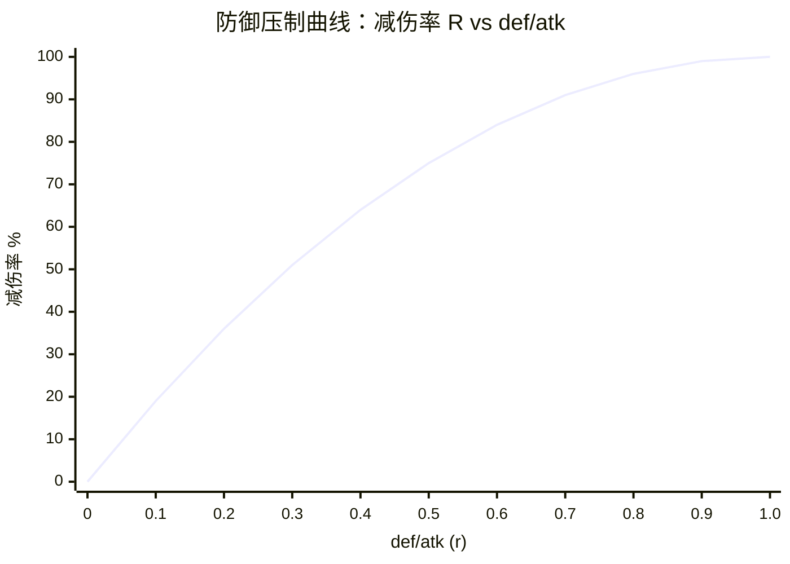
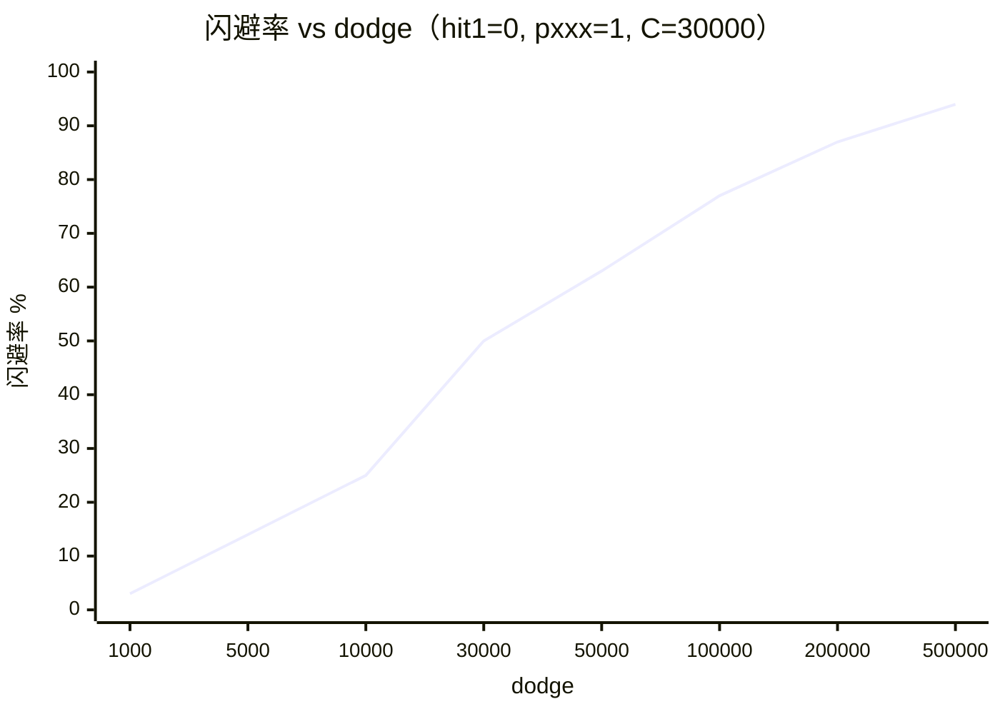
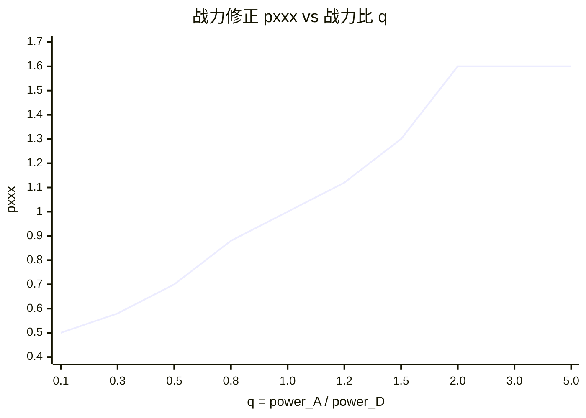
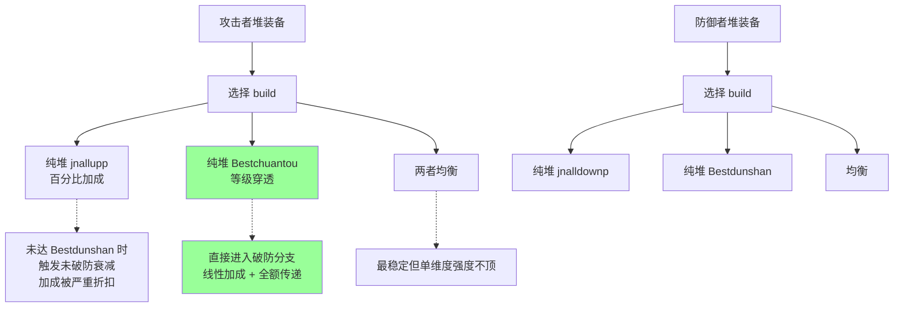
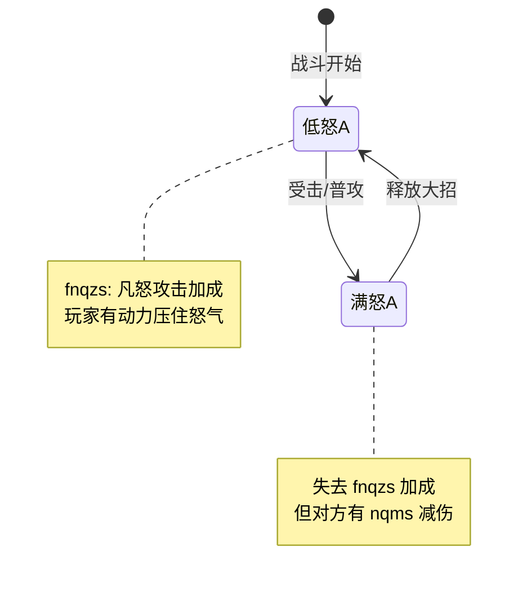
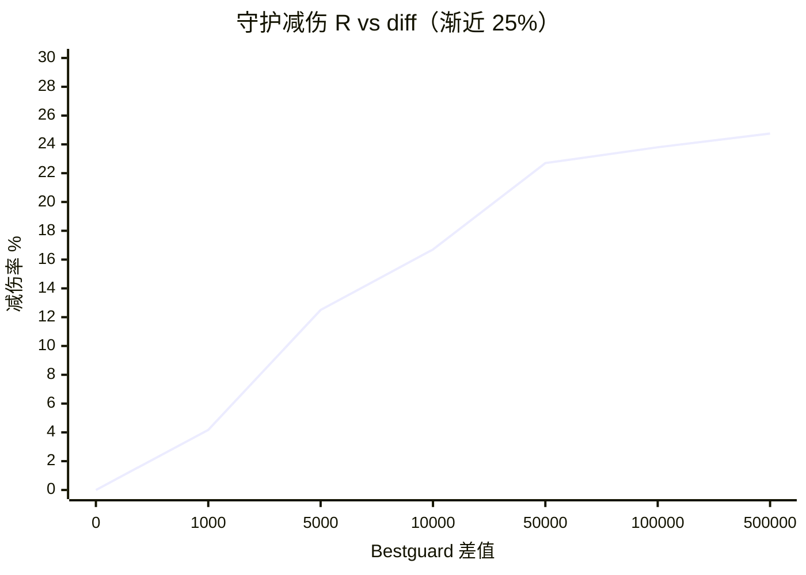
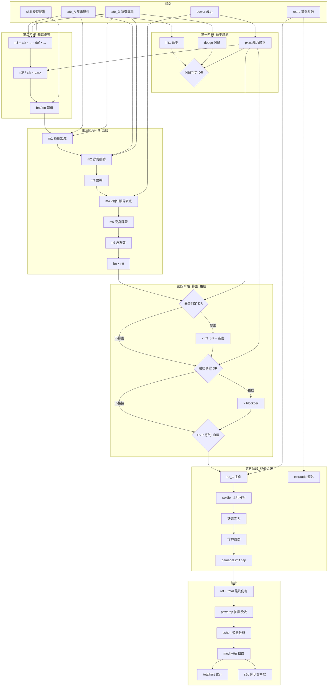
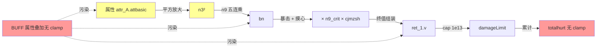

# 玩家伤害子系统数学建模

> **配套文档**：[damage_overflow_analysis.md](damage_overflow_analysis.md)（链路与溢出 bug 分析）
>
> **目的**：把 `state_fire.lua` 中每个战斗子系统都做"代数 + 数值 + 极限 + 设计意图"四维分析，形成可独立查阅的数学手册。
>
> **适用读者**：战斗策划、数值策划、后端工程师、QA。

---

## 目录

- [0. 数学约定与符号](#0-数学约定与符号)
- [1. 基础伤害层](#1-基础伤害层)
- [2. 概率对抗层（DR 曲线统一框架）](#2-概率对抗层dr-曲线统一框架)
- [3. 乘法加成层（n9 五层结构）](#3-乘法加成层n9-五层结构)
- [4. PVP 体验层](#4-pvp-体验层)
- [5. 横向系统层](#5-横向系统层)
- [6. 二次修正层](#6-二次修正层)
- [7. 终值组装与扰动](#7-终值组装与扰动)
- [8. 后处理层](#8-后处理层)
- [9. 次要系统](#9-次要系统)
- [10. 子系统耦合关系图](#10-子系统耦合关系图)
- [11. 极限边界分析](#11-极限边界分析)
- [附录 A — 公式速查表](#附录-a--公式速查表)
- [附录 B — 数学符号索引](#附录-b--数学符号索引)

---

## 0. 数学约定与符号

### 0.1 角色记号

| 符号 | 含义 |
|---|---|
| `A` | attacker（攻击者），对应代码 `a1` |
| `D` | defender（受击者），对应代码 `a2` |
| `attr_A.x` | 攻击者的属性 x |
| `attr_D.x` | 受击者的属性 x |

### 0.2 通用记号

| 符号 | 含义 |
|---|---|
| `P(·)` | 概率（[0, 1] 范围） |
| `clip(a, b, x)` | 截断到 `[a, b]` |
| `r` | 比率（一般指 def/atk 等） |
| `R` | 减伤率 (0~1) |
| `k` | buff 系数（一般 0~10） |
| `n` | 数值大小 |
| `C` | 软上限常数（DR 曲线分母） |
| `★` | 关键代码行或公式 |

### 0.3 项目专用记号

| 符号 | 含义 |
|---|---|
| `pxxx` | 战力修正系数（power 比率派生） |
| `n3` | 基础攻防伤害（步骤 3 中间变量） |
| `n9` | 通用百分比加成总乘积（步骤 4） |
| `bn` | 物理基础伤害累积量 |
| `en` | 元素基础伤害累积量 |
| `bd` | 终值随机扰动 + 武魂结拜系数 |
| `dx` | atk_i 段倍率 |
| `attr_x` | 技能配置的额外加成 |
| `damageLimit` | 终值上限 `9_999_999_999_999` |
| `MAXNUMBER` | 全局上限 `9_000_000_000_000_000`（≈ 2^53） |

### 0.4 数值上限约定

```
double 精确整数上限    : 2^53 ≈ 9.0072 × 10^15
项目全局上限 MAXNUMBER : 9.0000 × 10^15
伤害终值上限 damageLimit: 9.9999 × 10^12
属性配置常见量级        : 1e3 ~ 1e9
```

---

## 1. 基础伤害层

> 代码位置：`state_fire.lua:200-269`
>
> 这一层产出 `bn`（物理）/`en`（元素），是整套公式的"基础原料"。

### 1.1 攻防基础公式

```
n3 = attr_A[att_k] × (1 + elementdamage/100)
   - max(attr_D[def_k], 0) × (100 - attr_A.ignore + elementdefper)/100 × (1 + jiebai)
```

**代数分析**：

设：
- `atk = attr_A[att_k]`
- `def = max(attr_D[def_k], 0)`
- `e = elementdamage/100`（元素加伤率）
- `i = attr_A.ignore / 100`（穿甲率）
- `p = elementdefper / 100`（元素减伤率）
- `j = jiebai`（结拜倍率）

则：
```
n3_step1 = atk × (1 + e) - def × (1 - i + p) × (1 + j)
```

### 1.2 防御压制曲线（★ 全公式核心）

代码：

```lua
n3 = max(0, n3)
n3 = n3 × n3 / attr1[att_k] × pxxx        -- ★ state_fire.lua:254
```

**等价变形**：忽略 pxxx，设 `s = n3_step1`，原式 `= s² / atk`：

```
设 r = def / atk          (防御压制比)
则 s = atk × (1 - r)（忽略各种修正）
   s² / atk = atk × (1-r)²
```

**减伤函数**：

$$
R(r) = 1 - (1-r)^2 = 2r - r^2 \quad (r \in [0, 1])
$$

**数值表**：

| `def/atk` (r) | 输出系数 `(1-r)²` | 减伤率 `R(r)` | 每 +0.1 r 减伤增量 |
|---|---|---|---|
| 0.00 | 1.0000 | 0.0% | — |
| 0.10 | 0.8100 | 19.0% | +19% |
| 0.20 | 0.6400 | 36.0% | +17% |
| 0.30 | 0.4900 | 51.0% | +15% |
| 0.40 | 0.3600 | 64.0% | +13% |
| 0.50 | 0.2500 | **75.0%** | +11% |
| 0.60 | 0.1600 | 84.0% | +9% |
| 0.70 | 0.0900 | **91.0%** | +7% |
| 0.80 | 0.0400 | 96.0% | +5% |
| 0.90 | 0.0100 | **99.0%** | +3% |
| 0.95 | 0.0025 | 99.75% | +0.75% |
| 1.00 | 0.0000 | 100% | 触底，回退 2% 底保 |

**关键导数**：

$$
\frac{dR}{dr} = 2(1 - r)
$$

| r | dR/dr |
|---|---|
| 0 | 2.0（每 +0.01 r 减 2% 伤） |
| 0.5 | 1.0（每 +0.01 r 减 1% 伤） |
| 0.9 | 0.2（边际收益递减） |
| 1.0 | 0.0（接近完美防御时增量趋零） |

**渐近分析**：

- 当 `r → 0`：n3 → atk，等价于无防御裸打
- 当 `r → 1⁻`：n3 → 0⁺，但永不到 0
- 当 `r ≥ 1`：n3 = 0，回退到 `n1 = atk × 0.02` 底保

**Mermaid 可视化**：



**设计意图**：

| 性质 | 玩家体验 |
|---|---|
| `r < 0.3` 时减伤温和 | 微小防御差距不会让强者完全无敌 |
| `r ∈ [0.3, 0.7]` 减伤陡升 | 装备升级"挑落对手一档"有强烈反馈 |
| `r > 0.9` 边际收益骤减 | 单堆防御会越来越无效 |
| `r = 1` 完美压制但 + 2% 底保 | 避免新手秒杀 / PVP 完全免疫 |

---

### 1.3 元素加伤与减免线性叠加

```
n3 = atk × (1 + e) - def × (1 - i + p) × (1 + j)
```

**第一项 `(1 + e)`**：元素加伤是**线性加在攻击侧**。
- 若 `e = 0.5`（+50% 元素加伤）→ 攻击有效值放大 1.5×
- 注意：这是在防御压制平方之前发生的，所以 e 的影响会被平方放大

**第二项 `(1 - i + p)`**：穿甲与元素减伤**线性相消**。
- `i = 0.3, p = 0`：防御被穿掉 30%，等价于 def_effective = def × 0.7
- `i = 0, p = 0.5`：元素减伤 50%，等价于 def_effective = def × 1.5
- `i = 0.3, p = 0.5`：def_effective = def × 1.2（仍受减伤压制）

**`(1 + j)` 结拜系数**：进一步放大防御方等效防御，是 PVP 中"结拜联盟"对外抗压的来源。

### 1.4 加伤百分比层 n2

```
n2 = max(0, (attr_A[att_up] + attr_x + 100 - attr_D[def_down] + gdfjsh) / 100)
```

**模型**：

```
n2 = max(0, 1 + (a_up - d_down) / 100 + (attr_x + gdfjsh) / 100)
```

**性质**：
- 这是**线性差值**模型，攻防双方加成 1:1 抵消
- 与 n9 的 ×0.5 削弱不同 —— n2 这里**全额生效**
- 负数被截断到 0（不会负反伤）

**数值表**：

| a_up | d_down | n2 |
|---|---|---|
| 0 | 0 | 1.00 |
| 100 | 0 | 2.00 |
| 200 | 50 | 2.50 |
| 500 | 200 | 4.00 |
| 1000 | 500 | 6.00 |
| 10000 | 5000 | 51.00 |

### 1.5 底保 2% 与最小值 1

```
n1 = max(attr_A[att_k] × 0.02, n3)
ret[1].v = max(1, ceil(...))
```

| 保护层 | 目的 |
|---|---|
| `n1 ≥ atk × 0.02` | 完全压制时仍可造成 2% 攻击的伤害 |
| `ret[1].v ≥ 1` | 避免显示 0 伤害的尴尬 |
| `total ≥ 1` | 战斗事件链有意义 |

**触发条件**：
- 底保触发：`r = def/atk > 1 - √0.02 ≈ 0.859`（即防御 ≥ 86% 攻击时触发底保）
- 最小值 1 触发：终值计算结果 ≤ 0.5 时（极少见）

---

## 2. 概率对抗层（DR 曲线统一框架）

> 命中/暴击/格挡三大对抗都遵循同一个数学结构

### 2.1 统一 DR 曲线形式

**通式**：

$$
P_{trigger} = \text{clip}\left(0, 1, \frac{X_A \cdot \text{pxxx} - X_D}{X_A + C}\right)
$$

其中：
- `X_A`：攻击端关键属性
- `X_D`：防御端对抗属性
- `pxxx`：战力修正
- `C`：软上限常数

**三大应用**：

| 应用 | X_A | X_D | C | 触发结果 |
|---|---|---|---|---|
| **闪避** | dodge | hit1（攻方命中） | 30000 | 攻击 0 伤 |
| **暴击** | critical | tough2（防方韧性） | 50000 | 伤害 ×n9_crit |
| **格挡** | block | antiblock | 30000 | 伤害 × blockper |

代码对应：

```lua
-- 闪避 state_fire.lua:186
if random(1,100) < ceil((dodge/pxxx - hit1) / (dodge + 30000) * 100)

-- 暴击 state_fire.lua:423
if random(1,100) < ceil((critical*pxxx - tough2) / (critical + 50000) + attr_x) * 100)

-- 格挡 state_fire.lua:454
if random(1,100) < ceil((block/pxxx - antiblock) / (block + 30000) * 100)
```

⚠️ 注意闪避公式中 `dodge / pxxx`（pxxx 在分子），而暴击是 `critical × pxxx`（pxxx 是乘数）。设计意义：
- 战力高（pxxx > 1）时**更不容易被闪避**（dodge 被 pxxx 削弱）
- 战力高时**暴击率被放大**

### 2.2 命中-闪避对抗

**完整公式**：

```
hit1  = attr_A.hit  × (1 + job_hit/100  + tag_hit/100)
dodge = attr_D.dodge × (1 + job_dodge/100 + tag_dodge/100)

if 血量 > 70%:  hit1 *= 1 + mzzj/100
if awakenwssb 命中(35%): dodge *= (100 - awakenwssb)/100
if awakenwsmz 命中(35%): hit1  *= (100 - awakenwsmz)/100

P_dodge = clip(0, 1, (dodge/pxxx - hit1) / (dodge + 30000))
```

**闪避率数值表**（假设 pxxx = 1，hit1 = 0）：

| dodge | P_dodge |
|---|---|
| 1000 | 1000/31000 ≈ **3.2%** |
| 5000 | 5000/35000 ≈ 14.3% |
| 10000 | 10000/40000 = **25.0%** |
| 30000 | 30000/60000 = **50.0%**（拐点） |
| 50000 | 50000/80000 = 62.5% |
| 100000 | 100000/130000 ≈ 76.9% |
| 500000 | 500000/530000 ≈ **94.3%** |
| ∞ | 渐近 100% |

**hit1 对 dodge 的硬抵消**：

| dodge | hit1 | (dodge-hit1)/(dodge+30000) |
|---|---|---|
| 10000 | 0 | 25.0% |
| 10000 | 5000 | 12.5% |
| 10000 | 10000 | 0%（完全抵消） |
| 10000 | 20000 | 已负，clip 到 0 |

**Mermaid**：



**残血加成**：血量 > 70% 时 `hit1 *= 1 + mzzj/100`，是个"残血更不容易闪避"机制（mzzj = "命中追加"）。

**觉醒影响**：35% 触发率的 awakenwssb / awakenwsmz 是"概率性削弱对方"，等价于期望 `hit1 *= 1 - 0.35 × awakenwsmz/100`。

### 2.3 暴击-韧性对抗

**公式**：

```
critical    = attr_A.critical    × (1 + job_critical/100 + tag_critical/100)
tough2      = attr_D.tough       × (1 + job_tough/100   + tag_tough/100)
criticalage1     = attr_A.criticalage     + job_criticalage     + tag_criticalage
anticriticalage2 = attr_D.anticriticalage + job_anticriticalage + tag_anticriticalage

# 血量 < 30% 时
if costhp1 < 0.3: criticalage1 += bszj             # 残血爆击
if costhp2 < 0.3:
    anticriticalage2 += bmzj                        # 残血抗爆击
    tough2 *= 1 + rxzj/100                          # 残血加韧性

# 觉醒
if awakenwsrx 触发(35%): tough2 *= (100 - awakenwsrx)/100
if awakenwsbj 触发(35%): critical *= (100 - awakenwsbj)/100
if awakenwsbs 触发(35%): criticalage1 *= (100 - awakenwsbs)/100

P_crit = clip(0, 1, (critical × pxxx - tough2) / (critical + 50000) + attr_x)

if 暴击:
    if awakenwsbk 触发(35%): anticriticalage2 *= (100 - awakenwsbk)/100
    n9_crit = (150 + criticalage1 - anticriticalage2 + attr_x + bs) / 100
              × (random(100) ≤ cjbj ? cjbjsh/100 + 1 : 1)
    bn *= n9_crit
```

**暴击率数值表**（tough2 = 0, pxxx = 1）：

| critical | P_crit |
|---|---|
| 1000 | 1000/51000 ≈ **2.0%** |
| 5000 | 5000/55000 ≈ 9.1% |
| 10000 | 10000/60000 ≈ 16.7% |
| 50000 | 50000/100000 = **50.0%**（拐点） |
| 100000 | 100000/150000 ≈ 66.7% |
| 500000 | 500000/550000 ≈ **90.9%** |
| 1000000 | 1000000/1050000 ≈ 95.2% |
| ∞ | 100%（渐近） |

**注意 C = 50000 > 30000**（闪避/格挡），即**暴击堆叠"更难达到高水平"**。设计意图：暴击是高收益机制，应稀缺。

**暴击伤害倍率**（无连击触发）：

```
n9_crit = (150 + criticalage1 - anticriticalage2 + bs) / 100
```

| criticalage1 - anticriticalage2 | n9_crit |
|---|---|
| 0 | 1.50 |
| 100 | 2.50 |
| 500 | 6.50 |
| 1000 | 11.50 |
| 5000 | 51.50 |
| 10000 | 101.50 |

**连击叠乘 cjbj / cjbjsh**：

```
if random(100) ≤ cjbj: n9_crit *= (1 + cjbjsh/100)
```

- cjbj = 30, cjbjsh = 200：30% 概率再 ×3
- 期望倍率：`E = 1 + 0.30 × 2.0 = 1.60`

**最终暴击伤害（极限场景）**：

假设 `criticalage = 10000, cjbj = 100, cjbjsh = 500`：
```
n9_crit = (150 + 10000)/100 × (1 + 500/100) = 101.5 × 6 = 609
```
即暴击 + 连击可让伤害 ×609。这是 n9 后再乘一刀，是溢出的高危叠加项。

### 2.4 格挡-破格对抗

**公式**：

```
block     = attr_D.block     × (1 + job_block/100     + tag_block/100)
antiblock = attr_A.antiblock × (1 + job_antiblock/100 + tag_antiblock/100)

if awakenwsgd 触发(35%): block     *= (100 - awakenwsgd)/100
if awakenwspd 触发(35%): antiblock *= (100 - awakenwspd)/100

# hat_w_wsg = random ≤ cjmz（摸心触发不可格挡）
if not hat_w_wsg and random(100) < ceil((block/pxxx - antiblock) / (block + 30000) × 100):
    blockper = 0.5
    if attr_D.blockposs 触发: blockper = 0.5 × (1 - blockper_pct/100)
    bn *= blockper
    en *= blockper
```

**格挡率与闪避率结构完全一致**，C = 30000。

**格挡减伤模型**：

| blockposs | blockper_pct | 实际 blockper |
|---|---|---|
| 0%（不触发） | — | 0.5（基础半减） |
| 触发, pct = 30 | 30 | 0.5 × 0.7 = 0.35（减 65%） |
| 触发, pct = 50 | 50 | 0.5 × 0.5 = 0.25（减 75%） |
| 触发, pct = 80 | 80 | 0.5 × 0.2 = 0.10（减 90%） |
| 触发, pct = 100 | 100 | 0.0（完全免疫） |

**摸心机制**：攻方触发摸心（`hat_w_wsg`）时**绕过格挡判定**。设计意图：让"摸心流"成为反格挡战术。

### 2.5 战力修正 pxxx 详解

**代码**：

```lua
-- state_fire.lua:147-154
local pxxx = 1
if a1.power and a2.power and not nopxxxscene[tag] then
    local pper = a1.power / a2.power
    if pper > 1 then
        pxxx = math.min((1 + (pper - 1) * 0.6), 1.6)
    elseif pper < 1 then
        pxxx = math.max((1 - (1 - pper) * 0.6), 0.5)
    end
end
```

**数学形式**：

设 `q = power_A / power_D`：

$$
\text{pxxx}(q) = \begin{cases}
\max(1 - 0.6(1 - q), 0.5) & q < 1 \\
1 & q = 1 \\
\min(1 + 0.6(q - 1), 1.6) & q > 1
\end{cases}
$$

**数值表**：

| q = A_power / D_power | pxxx | 含义 |
|---|---|---|
| 0.1 | max(1 - 0.54, 0.5) = **0.5** | 战力远低，被压到下限 |
| 0.3 | 1 - 0.42 = 0.58 | 战力 1/3 |
| 0.5 | 1 - 0.3 = 0.70 | 战力一半 |
| 0.8 | 1 - 0.12 = 0.88 | 战力略低 |
| 1.0 | **1.00** | 战力相当 |
| 1.2 | 1 + 0.12 = 1.12 | 战力略高 |
| 1.5 | 1 + 0.30 = 1.30 | 战力优势 |
| 2.0 | 1 + 0.60 = **1.60** | 战力 2× → 上限 |
| 5.0 | clamp → 1.60 | 战力 5×，仍是 1.60 |

**Mermaid**：



**性质**：
- **非对称**：[0.5, 1.6] 而非 [0.4, 1.6]，下限 0.5 是为"小号挑战大号"留生路
- **线性 + clamp**：简单可控
- **影响三个地方**：n3 平方 × pxxx、闪避率、暴击率、格挡率
- **场景排除**：`nopxxxscene = {ylzc = true, exile = true}` 在凉宫春日 / 流放战场不生效

**关键洞察**：pxxx ∈ [0.5, 1.6]，但因为参与 `n3 × n3 × pxxx`（已平方），实际对伤害的影响是**线性**的。在战力比对抗 PVP 场景下，pxxx 让"硬碾压"和"以小博大"都有上限。

---

## 3. 乘法加成层（n9 五层结构）

> 这是溢出的最大温床，也是商业化系统差异化的核心。

### 3.1 整体乘法链

**公式总览**：

```
n9 = (100 + allupp × 0.5 - alldownp × 0.5 + n8) / 100     -- ① 通用加成
   × M_jnallupp(attr_A, attr_D)                            -- ② 穿防（含 Bestchuantou 分支）
   × (100 + ssallupp × 0.5 - ssalldownp × 0.5) / 100      -- ③ 兽神
   × sgta × sgtb                                            -- ④ 四象（根号 + 战力修正）
   × max(1 + (bsallup - bsalldownp)/100, min_fix or 0.01)  -- ⑤ 变身阵营

bn *= n9
en *= n9 (若元素)
```

**乘法链建模**：

设五层各自的乘数为 `m_1, m_2, m_3, m_4, m_5`，则 `n9 = ∏ m_i`。

**单层放大与组合放大**：

| 单层 m_i | 5 层全相同时 n9 | 含义 |
|---|---|---|
| 1.0 | 1.0 | 无加成 |
| 1.5 | 7.59 | 每层 +50% |
| 2.0 | 32 | 每层 +100% |
| 3.0 | 243 | 每层 +200% |
| 5.0 | 3,125 | 每层 +400% |
| 10.0 | 100,000 | 每层 +900% |
| 51.0 | 51^5 ≈ 3.45 × **10^8** | 每层名义 +10000%（×0.5 后实际 +5000%） |

> **当所有层达到 m=51 时，仅 n9 一项就能让伤害放大 3.45 亿倍**。这是 Bug 3（中间值突破 2^53）的根本机理。

### 3.2 第 1 层：通用加成 allupp

**公式**：

```
allupp_total = allupp + job_allupp + tag_allupp + petjc + (genre_allupp 若有荣耀锦标赛)
alldownp_total = alldownp + job_alldownp + tag_alldownp + ridealldownp + (genre_alldownp 若有)
m_1 = (100 + allupp_total × 0.5 - alldownp_total × 0.5 + n8) / 100
```

**`n8` 狂暴/见血如雷**：

```
n8 = costhp1% × kuangbao - costhp2% × jian1ren4
```

| 攻方残血率 | kuangbao | 防方残血率 | jian1ren4 | n8 |
|---|---|---|---|---|
| 0% | 100 | 0% | 100 | 0 |
| 50% | 100 | 0% | 100 | 50 |
| 0% | 100 | 50% | 100 | -50 |
| 80% | 200 | 80% | 200 | 0（对消） |

**关键性质：×0.5 削弱的数学意义**：

设 `a = allupp_total - alldownp_total`：

```
m_1 = 1 + a / 200 + n8 / 100
```

| a（净加成） | 不带 ×0.5 | 带 ×0.5（实际） |
|---|---|---|
| 100 | 2.00 | 1.50 |
| 500 | 6.00 | 3.50 |
| 1000 | 11.00 | 6.00 |
| 5000 | 51.00 | 26.00 |
| 10000 | 101.00 | 51.00 |

**×0.5 的设计目的**：让 buff 名义值显示得"很大"（玩家心理），但实际生效减半（数值平衡）。

**子来源**：

```
allupp_total 的组成：
├─ 装备 allupp（基础）
├─ 职业 job_allupp（如 frozen 法师附加）
├─ 场景 tag_allupp（如 PVP 副本 arena_allupp）
├─ 宠物加成 petjc = red6petzs + redpetzs + orangepetzs（仅 a1 是 pet）
└─ 荣耀锦标赛 genre_allupp（限定模式）
```

⚠️ **petjc 子模型**：

```
red6petzs    = (attr_A.red6petzs or 0)/10    × ((random ≤ 35 ? attr_A.red6petzsew/1000 : 0) + 1)
redpetzs     = 同上结构
orangepetzs  = 同上结构
petjc        = red6petzs + redpetzs + orangepetzs
```

每个分量都有 35% 概率触发自身倍率（额外 `attr.xxxpetzsew/1000` 系数）。

期望值：
```
E[red6petzs] = red6petzs/10 × (1 + 0.35 × red6petzsew/1000)
```

### 3.3 第 2 层：穿防加成 + 破防机制

**公式（玩家攻击 + Bestchuantou ≥ Bestdunshan）**：

```
若 (jnallupp - jnalldownp) ≤ -1：              # 未破防分支
    若 jnallupp / jnalldownp ≤ 0.95：
        # 复杂衰减公式
        t = max(Bestchuantou - ((jnalldownp × 0.5 × 0.95 - jnallupp × 0.5) × 10) - Bestdunshan, 0)
        k = jnalldownp - min(jnallupp × 0.5 + Bestchuantou/100 × 10, jnalldownp × 0.5 × 0.95) × t/(t+80)
        aa = 1 + min(jnallupp + Bestdunshan/100 × 10, jnalldownp × 0.5 × 0.95)
             - jnalldownp × 0.5 + k
    else：
        t = max(Bestchuantou - Bestdunshan, 0)
        k = jnallupp × 0.5 - jnalldownp × 0.5 × t/(t+80)
        aa = (100 + jnallupp × 0.5 - jnalldownp × 0.5)/100 + k

    若 aa ∈ (0, 1]：
        m_2 = aa                                 # 加成被衰减
    else：
        # 触发"难破防固定增益"
        t = Bestchuantou - Bestdunshan
        b = 1 + 2 × t/(t+6000) × 0.01
        min_fix = min(b, 0.03)                   # ★ 这值会影响第 5 层最终 max
        m_2 = (默认) 不在此分支应用

else：                                            # 破防分支
    m_2 = 1 + (jnallupp - jnalldownp) × 0.5
        + (Bestchuantou - Bestdunshan)/100

若 不满足玩家 + 等级条件：                        # 普通分支
    m_2 = (100 + jnallupp × 0.5 - jnalldownp × 0.5) / 100
```

**关键阈值**：

```
门槛 1：Bestchuantou ≥ Bestdunshan（等级达标）
门槛 2：jnallupp - jnalldownp ≤ -1（百分比劣势）
门槛 3：jnallupp / jnalldownp ≤ 0.95（劣势程度）
```

**未破防（劣势）分支的衰减结构**：

定义 `t = max(Bestchuantou - Bestdunshan, 0)`，则衰减函数：

$$
f(t) = \frac{t}{t + 80}
$$

| t | f(t) | 衰减程度 |
|---|---|---|
| 0 | 0% | 完全衰减（等级持平时无加成传递） |
| 80 | 50% | 一半衰减 |
| 200 | 71% | 主要传递 |
| 500 | 86% | 接近全传递 |
| 1000 | 93% | 几乎全传递 |
| 5000 | 98% | 渐近 100% |

这是又一条 DR 曲线，软上限 80。

**破防分支的线性结构**：

```
m_2 = 1 + (jnallupp - jnalldownp) × 0.5 + (Bestchuantou - Bestdunshan)/100
```

**数值表**（破防分支）：

| jnallupp - jnalldownp | Bestchuantou - Bestdunshan | m_2 |
|---|---|---|
| 0 | 0 | 1.00（持平） |
| 100 | 0 | 1.50 |
| 0 | 100 | 2.00 |
| 100 | 100 | 2.50 |
| 1000 | 500 | 1 + 5 + 5 = 11.0 |
| 5000 | 1000 | 1 + 25 + 10 = **36.0** |
| 10000 | 5000 | 1 + 50 + 50 = **101.0** |

⚠️ **`Bestchuantou - Bestdunshan` 直接除以 100 加进 m_2，无任何衰减或上限**。这是穿防 build 的爆点。

**设计意图**：



**洞察**：装备克制循环鼓励玩家**优先堆 Bestchuantou**（更稳定地进入破防分支），但这同时是**溢出最危险的路径**（线性无衰减）。

### 3.4 第 3 层：兽神加成 ssallupp

**公式**：

```
m_3 = (100 + ssallupp × 0.5 - ssalldownp × 0.5) / 100
```

**结构与 allupp 完全一致**。区别仅在数据来源：
- ssallupp / ssalldownp 来自"兽神殿"系统
- 与铁蹄之力 Ironheelpower、守护 Bestguard 同体系

**数值表**（同 3.2 的 ×0.5 模型）：

| ssallupp - ssalldownp | m_3 |
|---|---|
| 0 | 1.00 |
| 100 | 1.50 |
| 1000 | 6.00 |
| 5000 | 26.00 |
| 10000 | 51.00 |

### 3.5 第 4 层：四象加成（根号衰减 + 战力修正）

**公式**：

```
# sgta 部分
raw_sgta = max((sgallupp - sgalldownp)/100, -1.0)
if raw_sgta > 1:
    raw_sgta = ceil(sqrt(raw_sgta) × 100) / 100   # ★ 根号衰减
sgta = 1 + raw_sgta

# sgtb 部分（与战力比挂钩）
raw_sgtb = (attr_A.sgenergy - attr_D.sgenergy) / 1000
if not (power_A and power_D):
    raw_sgtb = raw_sgtb × 1
elif power_A ≤ power_D:
    raw_sgtb = raw_sgtb × (power_A / power_D)
else:
    raw_sgtb = raw_sgtb × ceil(sqrt(power_A/power_D) × 100) / 100  # 根号衰减
sgtb = max(0, 1 + raw_sgtb)

m_4 = sgta × sgtb
```

**sgta 数值表**：

| sgallupp - sgalldownp | raw_sgta | sgta |
|---|---|---|
| -100 | -1.00 | 0.00 |
| 0 | 0 | 1.00 |
| 50 | 0.5 | 1.50 |
| 100 | 1.00 | 2.00 |
| 200 | √2 ≈ 1.41 | **2.41**（根号触发）|
| 500 | √5 ≈ 2.24 | 3.24 |
| 1000 | √10 ≈ 3.16 | 4.16 |
| 10000 | √100 = 10.00 | 11.00 |
| 1000000 | √10000 = 100 | 101 |

**根号衰减的数学性质**：

设 `x = (sgallupp - sgalldownp)/100`，当 `x > 1`：

$$
\text{sgta}(x) = 1 + \sqrt{x}
$$

| 输入 x | 输出 sgta | 边际收益 d/dx |
|---|---|---|
| 1 | 2 | 0.5 |
| 4 | 3 | 0.25 |
| 100 | 11 | 0.05 |
| 10000 | 101 | 0.005 |

**意义**：单一系统突破 +100% 后，**每加 1 名义点带来的收益按 1/(2√x) 衰减**。这是单层"反爆装"机制。

**sgtb 战力修正**：

| 战力关系 | raw_sgtb 乘数 | 含义 |
|---|---|---|
| 无战力数据 | × 1 | 无修正 |
| `power_A ≤ power_D` | `× (power_A / power_D)` | 战力弱方加成被线性削弱 |
| `power_A > power_D` | `× √(power_A/power_D)` | 战力强方加成被根号削弱 |

**关键设计**：弱者**线性**惩罚（差距越大越无力），强者**根号**惩罚（差距越大边际收益越小但绝对值仍上升）。这种**非对称设计**让"高战碾压"和"低战逆袭"都不容易。

**数值表**（sgenergy 差 = 1000，即 raw_sgtb = 1.0 基础）：

| power_A / power_D | raw_sgtb 修正后 | sgtb |
|---|---|---|
| 0.25 | 1.0 × 0.25 = 0.25 | 1.25 |
| 0.5 | 1.0 × 0.5 = 0.50 | 1.50 |
| 1.0 | 1.0 × 1.0 = 1.00 | 2.00 |
| 2.0 | 1.0 × √2 ≈ 1.41 | 2.41 |
| 4.0 | 1.0 × 2.00 = 2.00 | 3.00 |
| 100 | 1.0 × 10.0 = 10.0 | 11.0 |

**m_4 总览**：

四象层是 5 层中**自带衰减最完善的一层**。即使 sgallupp = sgalldownp = 各 100 万，sgta 也只到 101，远比直乘的 allupp 安全。

### 3.6 第 5 层：变身阵营加成

**公式**：

```
bsallup    = attr_A['bs_' + 攻方阵营 + '_' + 守方阵营 + '_allupp']     + attr_A.alluppbs
bsalldownp = attr_A['bs_' + 攻方阵营 + '_' + 守方阵营 + '_alldownp']   + attr_D.alldownpbs

m_5 = max(1 + (bsallup - bsalldownp)/100, min_fix or 0.01)
```

**结构**：与 allupp 类似但**没有 ×0.5 削弱**，全额生效。

**数值表**：

| bsallup - bsalldownp | m_5 |
|---|---|
| 0 | 1.00 |
| 50 | 1.50 |
| 100 | 2.00 |
| 500 | 6.00 |
| 1000 | 11.00 |
| 5000 | 51.00 |

**min_fix 兜底**：来自 §3.3 穿防分支的特殊增益值（最大 0.03），用于"未破防但等级压制"的微弱伤害保留。

**设计意图**：变身阵营是**版本玩法**（如周年庆变身福袋），数值通常按阵营组合查表，因此**不再削弱**。

### 3.7 全链路最坏情况边界

**理论上限演算**（每层用合理的"满配"数值）：

```
m_1 (allupp,   净+5000) = 26.00
m_2 (穿防,    破防分支, jnallupp-jnalldownp=5000, Bestchuantou-Bestdunshan=1000) = 36.00
m_3 (ssallupp, 净+5000) = 26.00
m_4 (sgta + sgtb)       ≈ √50 × √5 = 7.07 × 2.24 ≈ 15.84
m_5 (bsallup, 净+500)   = 6.00

n9 = 26 × 36 × 26 × 15.84 × 6 ≈ 2.31 × 10^6
```

**单独穿防爆点演算**（Bestchuantou 极端）：

```
m_2 = 1 + (jnallupp - jnalldownp) × 0.5 + (Bestchuantou - Bestdunshan)/100
    = 1 + 5000 × 0.5 + 50000/100
    = 1 + 2500 + 500
    = 3001     ← ★ 单层就 3001×
```

5 层乘积可达 **10^9 ~ 10^10 量级**。

---

## 4. PVP 体验层

> 仅在 `a1.who == 'player' and a2.who == 'player'` 时生效

### 4.1 怒气系统

**公式**：

```
rate = 1
if attr_A.wrath < 50:    rate += fnqzs / 100     # 自己凡怒（增伤）
if attr_D.wrath < 50:    rate -= fnqms / 100     # 对面凡怒（免伤）
if attr_D.wrath > 50:    rate -= nqms / 100      # 对面怒气（免伤）
```

**状态机分析**：

| attr_A.wrath | attr_D.wrath | rate（仅怒气部分） |
|---|---|---|
| < 50 | < 50 | 1 + fnqzs/100 - fnqms/100 |
| < 50 | > 50 | 1 + fnqzs/100 - nqms/100 |
| ≥ 50 | < 50 | 1 - fnqms/100 |
| ≥ 50 | > 50 | 1 - nqms/100 |
| ≥ 50 | == 50 | 1（无任何调整） |

**设计意图**：



让"怒气状态"成为战术资源 —— 玩家可以选择"压怒"（保留 fnqzs）或"放大招"（消耗怒气）。

### 4.2 血量优势 / 残血逆袭

**公式**：

```
costhp1 = (hpmax1 - hp1) / hpmax1      # 攻方失血率
costhp2 = (hpmax2 - hp2) / hpmax2      # 守方失血率

if (1 - costhp1) > (1 - costhp2):      # 攻方血量优势
    rate += xlyz / 100 - fxljm / 100   # 血量优势加成 - 反血量优势减免
if (1 - costhp1) < (1 - costhp2):      # 攻方血量劣势
    rate += fxlyz / 100                # 反血量优势加成（残血逆袭）

rate = max(rate, 0.1)
```

**关键不等式**：

```
(1 - costhp1) > (1 - costhp2)
⇔ hp1/hpmax1 > hp2/hpmax2
⇔ 攻方残血率 < 守方残血率
⇔ 攻方更"健康"
```

**数值表**（假设 xlyz=200, fxljm=100, fxlyz=300）：

| 攻方 hp% | 守方 hp% | 触发分支 | rate（仅这部分） |
|---|---|---|---|
| 100% | 100% | 持平，无加成 | 1.00 |
| 80% | 50% | 攻方优势 | 1 + 2.0 - 1.0 = 2.00 |
| 50% | 50% | 持平 | 1.00 |
| 30% | 80% | 攻方劣势（残血逆袭） | 1 + 3.0 = 4.00 |
| 5% | 95% | 极端逆袭 | 4.00 |

**底保 0.1**：rate 最小不低于 0.1，即"再不利也能打出 10% 伤害"。

**设计意图**：

| 场景 | 设计感 |
|---|---|
| 健康方加成（xlyz） | 推奖"乘胜追击" |
| 健康方反加成（fxljm） | 防止纯优势方碾压（让对手有翻盘点） |
| 残血方逆袭（fxlyz） | **戏剧性 PVP** —— 残血翻盘是最爽的体验 |

### 4.3 残血加成（步骤 5 的 bszj/bmzj/rxzj）

来自步骤 5 暴击层的残血触发：

```
if costhp1 < 0.3:    criticalage1     += bszj                # 残血爆击加成
if costhp2 < 0.3:    anticriticalage2 += bmzj                # 残血抗爆击
                     tough2 *= 1 + rxzj/100                  # 残血加韧性
```

**叠加效应建模**：

假设玩家 hp = 25% 且开启残血 build：
- criticalage1 + bszj （爆伤更高）
- 同时对方 hp 也低 → 触发 fxlyz 残血逆袭

两个机制叠加 → 残血方爆伤期望：

```
E[damage] = bn × n9 × (1 + P_crit × (n9_crit - 1)) × rate_pvp
                                ↑                    ↑
                          残血时 +bszj            残血时 +fxlyz
```

形成**残血复合 buff**，是 PVP 翻盘的数学基础。

---

## 5. 横向系统层

> 不参与 n9 乘法链，独立加在最后

### 5.1 铁蹄之力（6 段位阶梯）

**公式**：

```
Ironheelpower = max(0, attr_A.Ironheelpower - attr_D.Ironheelpower)
Ironheelpower = min(Ironheelpower, 1500)             # ★ 硬上限 1500

ironheel_damage = max(1, ceil(total × Ironheelpower / 10000))
total          = max(1, ceil(total × (1 + Ironheelpower/10000)))
ret[3]         = {v = ironheel_damage, c = 段位标签}
ret[1].v      += ret[3].v
```

**段位映射表**：

| Ironheelpower 区间 | 段位 标签 | 段位含义 |
|---|---|---|
| (0, 250] | jrjf | 金戎驾辉 |
| (250, 500] | ldjt | 流电劲蹄 |
| (500, 750] | jfxy | 戎风萧扬 |
| (750, 1000] | zszy | 战速踪影 |
| (1000, 1250] | jyyw | 戎旗炎武 |
| (1250, 1500] | syxq | 神戎旭曦 |

**伤害倍率**：

| Ironheelpower | 加成 | 总系数 |
|---|---|---|
| 0 | 0% | 1.00 |
| 250 | 2.5% | 1.025 |
| 500 | 5.0% | 1.05 |
| 750 | 7.5% | 1.075 |
| 1000 | 10% | 1.10 |
| 1250 | 12.5% | 1.125 |
| 1500 | **15%** | **1.15** |

**数学模型**：

$$
\text{IronHeelMultiplier} = 1 + \min(\max(\Delta IH, 0), 1500) / 10000
$$

线性 + clamp，**温和加成**。

**设计意图**：横向系统**不参与 n9 乘法链**，避免和主战力系统冲突。最多 +15% 是有意控制的（防止系统破坏平衡）。

### 5.2 守护减伤（25% 渐近）

**公式**：

```
shouhu1 = attr_A.Bestguard or 0
shouhu2 = attr_D.Bestguard or 0
if shouhu2 > shouhu1:
    diff           = shouhu2 - shouhu1
    reduction_num  = diff
    reduction_den  = 20000 + 4 × diff
    reduction_rate = reduction_num / reduction_den     # ★ 渐近 25%

    total    -= ceil(total    × reduction_rate)
    ret[1].v -= ceil(ret[1].v × reduction_rate)
    ret[3].v -= ceil(ret[3].v × reduction_rate)
```

**减伤函数**：

$$
R(\Delta) = \frac{\Delta}{20000 + 4\Delta}
$$

**数值表**：

| diff | R(diff) |
|---|---|
| 0 | 0% |
| 100 | 0.5% |
| 1000 | 4.17% |
| 5000 | 12.5% |
| 10000 | 16.7% |
| 50000 | 22.7% |
| 100000 | 23.8% |
| 1000000 | 24.88% |
| ∞ | **25.00%**（渐近上限） |

**关键数学性质**：

$$
\lim_{\Delta \to \infty} R(\Delta) = \frac{1}{4} = 25\%
$$

证明：

$$
R(\Delta) = \frac{\Delta}{20000 + 4\Delta} = \frac{1}{4} \cdot \frac{\Delta}{5000 + \Delta} \to \frac{1}{4}
$$

**意义**：守护是"防御方横向系统"，最多减伤 25%（不可能完全免疫）。

**Mermaid**：



**与铁蹄对比**：

| 维度 | 铁蹄 | 守护 |
|---|---|---|
| 方向 | 攻击端 | 防御端 |
| 上限 | +15% 增伤（硬截） | -25% 减伤（渐近） |
| 模型 | 线性 + clamp | DR 曲线 |
| 数据规模 | 0~1500 | 任意（差值意义） |

---

## 6. 二次修正层

### 6.1 元素伤害

**触发率**：

```
iseln = random(1, 100) ≤ skill.erate × (1 + attr_A.erateup - attr_D.eratedown)
```

**期望触发率**：

$$
P_{element} = \text{skill.erate} \cdot (1 + \text{erateup} - \text{eratedown}) / 100
$$

| skill.erate | erateup | eratedown | P_element |
|---|---|---|---|
| 30 | 0 | 0 | 30% |
| 30 | 0.5 | 0 | 45% |
| 50 | 1.0 | 0.5 | 75% |
| 100 | 0 | 0 | 100% |

**伤害侧公式**（步骤 3 已含）：

```
if iseln:
    n3 = atk × (1 + elementdamage/100) - def × (1 - ignore + elementdefper)/100 × (1 + jiebai)
        ↑                                                  ↑
       elementdamage 加伤                          elementdefper 减伤
                                                  （以概率 elementdefposs 触发）
```

**元素互动**：

```
en *= max(1 + elementsup/100 - elementsdown/100, 0.01)
```

最终元素伤害再被一次"元素抗性"调整。

**数值表**（仅元素调整层）：

| elementsup | elementsdown | 倍率 |
|---|---|---|
| 0 | 0 | 1.00 |
| 100 | 0 | 2.00 |
| 0 | 100 | 0.01（触底） |
| 200 | 100 | 2.00 |

### 6.2 觉醒系统（12 项 35% 触发）

**通用形式**：

```
if 攻击者有 awakenwsXX 且 random(100) < 35:
    某项属性 *= (100 - awakenwsXX) / 100
```

**12 项列表**：

| 觉醒项 | 作用 | 公式 |
|---|---|---|
| `awakenwssb` (闪避破) | 削弱对方闪避 | `dodge *= (100-w)/100` |
| `awakenwsmz` (命中破) | 削弱对方命中 | `hit *= (100-w)/100` |
| `awakenwsfy` (防御破) | 削弱对方物/魔防 | `phydef/magdef *= (100-w)/100` |
| `awakenwsyk` (元素防破) | 削弱对方元素防 | `flamedef/frozendef/thunderdef *= (100-w)/100` |
| `awakenwsgj` (攻击破) | 削弱对方物攻 | `attbasic *= (100-w)/100` |
| `awakenwsys` (元素攻破) | 削弱对方元素攻 | `attelement *= (100-w)/100` |
| `awakenwsbk` (抗爆破) | 削弱对方抗爆 | `anticriticalage *= (100-w)/100` |
| `awakenwsbj` (暴击破) | 削弱对方暴击 | `critical *= (100-w)/100` |
| `awakenwsbs` (爆伤破) | 削弱对方爆伤 | `criticalage *= (100-w)/100` |
| `awakenwsrx` (韧性破) | 削弱对方韧性 | `tough *= (100-w)/100` |
| `awakenwsgd` (格挡破) | 削弱对方格挡 | `block *= (100-w)/100` |
| `awakenwspd` (破格破) | 削弱对方破格 | `antiblock *= (100-w)/100` |

**期望模型**：

```
E[属性] = 属性 × (1 - 0.35 × awakenwsXX/100)
```

**数值表**（单项削弱）：

| awakenwsXX | 期望削弱率 | 期望 buff/debuff |
|---|---|---|
| 0 | 0 | 0% |
| 20 | 0.35 × 20% = 7% | 期望削弱 7% |
| 50 | 0.35 × 50% = 17.5% | 期望削弱 17.5% |
| 100 | 0.35 × 100% = 35% | 完全削弱时期望 35% |

**叠加问题**：

12 项独立 35% 概率，单次攻击平均触发数：

$$
E[触发数] = 12 \times 0.35 = 4.2
$$

但实际生效率取决于各项 awakenwsXX 的配置。

**设计意图**：
- 觉醒是**"针对性削弱"**机制，非全局加成
- 35% 触发率让觉醒效果**有随机性**而非保底
- 12 项各自独立，鼓励玩家根据对手 build 选择觉醒方向

### 6.3 摸心（cjmz / cjmzsh）

**公式**：

```
hat_w_wsg = random(1, 100) ≤ attr_A.cjmz       # 摸心触发概率
if hat_w_wsg:
    bn *= cjmzsh/100 + 1                        # 摸心增伤
    # 同时绕过格挡判定（步骤 6 不触发 blockper）
```

**伤害模型**：

$$
\text{摸心终值倍率} = \begin{cases}
1 + \text{cjmzsh}/100 & \text{触发率 } P = \text{cjmz}/100 \\
1 & \text{未触发}
\end{cases}
$$

**期望**：

$$
E[摸心倍率] = 1 + (\text{cjmz}/100) \times (\text{cjmzsh}/100)
$$

**数值表**：

| cjmz | cjmzsh | E[倍率] |
|---|---|---|
| 10 | 100 | 1.10 |
| 20 | 200 | 1.40 |
| 30 | 300 | 1.90 |
| 50 | 500 | 3.50 |
| 100 | 1000 | 11.00 |

**摸心 vs 暴击区别**：

| 维度 | 暴击 | 摸心 |
|---|---|---|
| 倍率应用位置 | 步骤 5（参与 n9 之前） | 步骤 8（终值组装时） |
| 是否被格挡 | 是 | **否（绕格挡）** |
| 是否被韧性对抗 | 是（tough） | 否 |
| 计算 | DR 曲线 | 简单概率 |

**设计意图**：摸心是**"百分百穿透防御机制的稀有高伤"**，作为暴击之上的二级输出爆点。

### 6.4 宠物加成 petjc

**公式**：

```
仅当 a1.who == "pet"：
    red6petzs    = (attr_A.red6petzs or 0)/10    × ((random ≤ 35 ? attr_A.red6petzsew/1000 : 0) + 1)
    redpetzs     = (attr_A.redpetzs or 0)/10     × ((random ≤ 35 ? attr_A.redpetzsew/1000 : 0) + 1)
    orangepetzs  = (attr_A.orangepetzs or 0)/10  × ((random ≤ 35 ? attr_A.orangepetzsew/1000 : 0) + 1)
    petjc        = red6petzs + redpetzs + orangepetzs
    # petjc 加入 allupp（第 3.2 节）
```

**单项期望**：

$$
E[\text{red6petzs}] = \frac{\text{red6petzs}}{10} \cdot \left(1 + 0.35 \cdot \frac{\text{red6petzsew}}{1000}\right)
$$

**数值表**（单项）：

| red6petzs | red6petzsew | E[贡献] |
|---|---|---|
| 100 | 0 | 10.0 |
| 100 | 1000 | 10 × 1.35 = 13.5 |
| 1000 | 5000 | 100 × 2.75 = 275 |
| 5000 | 10000 | 500 × 4.5 = 2250 |

**总 petjc**：

```
E[petjc] = E[red6petzs] + E[redpetzs] + E[orangepetzs]
```

**关键性质**：
- 仅宠物攻击触发，**玩家直接攻击时 petjc = 0**
- 加入 allupp 池，参与第 1 层 ×0.5 削弱
- 颜色阶梯：red6 / red / orange（红六、红、橙）

### 6.5 武魂 / 结拜

**公式**：

```
# 武魂领域
wuhun_lingyu_xishu = a1.wuhun_lingyu_dmg(skill.index)

# 结拜技能 2（队员数 ≥ 2 时增伤）
if jbskill2 and igroup.memcnt > 1 and igroup.skills[2]:
    jbjiac = cfg_jiebai.skills[2].attr[level].attr

# 结拜技能 3（血池战场 + 同结拜组减伤）
if a2.battle.iname == "blood" and atk.group == def.group:
    jbdianfeng = cfg_jiebai.skills[3].attr[level].attr

# 结拜技能 4（野外打 boss + 满足条件）
if a2.battle.iiname == "yewai" and a2.who == "monster" and ...:
    jbbosszs = cfg_jiebai.skills[4].attr[level].attr

# 全部加入 bd
bd = (0.95 + random(0,10)/100) + wuhun_lingyu_xishu + jbjiac - jbdianfeng + jbbosszs + zengshangrate
```

**性质**：
- 这些都是**额外加在 bd 上**，不参与 n9
- jbdianfeng 是**减号**：同结拜组在血池战场时**互相减伤**（保护机制）
- jbbosszs 是 PVE 限定（野外 boss）

---

## 7. 终值组装与扰动

### 7.1 bd 浮动模型

**公式**：

```
bd = (0.95 + random(0, 10)/100)            # 基础浮动 [0.95, 1.05]
   + wuhun_lingyu_xishu                     # 武魂
   + jbjiac                                 # 结拜2
   - jbdianfeng                             # 结拜3（互相减伤）
   + jbbosszs                               # 结拜4
   + (a2.zengshangrate or 0)                # 受击增伤
```

**基础浮动数学**：

$$
\text{bd}_{base} \sim U(0.95, 1.05)
$$

期望值 1.00，方差 `(1.05-0.95)²/12 = 0.000833`，标准差 ≈ 0.029。

**意义**：让伤害数字"看起来不固定"，增加战斗手感。±5% 是经验值（不会让"手感"失真，但有视觉差异）。

### 7.2 final_damage_x

```lua
rtn.final_damage_x = 1   -- entity.lua:88
```

各场景可重置：
- 训练场可能设 0.5（练手时低伤）
- 特殊副本可能设 2.0（高难度高输出）
- 宠物可能继承 `sdata.zhuzhen.hurt`（player.lua:96）

**最终乘法**：

```
ret[1].v = ceil((bn × bd × final_damage_x × cjmzsh_mult + extraadd) × extrarate)
```

### 7.3 extra.hpp 与 extra.bianshenid

**公式**：

```
if extra.hpp:
    extraadd = floor(attr_D.hp × extra.hpp / 100)
if extra.bianshenid 匹配 attr_D.bianshenid:
    extrarate += extra.per / 100
```

**hpp 模型**：
- 当前 HP 百分比真伤（不走攻防计算）
- 反 Boss 神技（"扣 5% 当前血"）

**数值表**：

| extra.hpp | attr_D.hp | extraadd |
|---|---|---|
| 5 | 1e10 | 5e8 |
| 10 | 1e10 | 1e9 |
| 50 | 1e10 | 5e9 |

**注意**：`extraadd` 是直接累加到主伤害的，与 n9 / bn 无关，是另一条溢出路径。

### 7.4 主伤害 / 元素伤害 / 铁蹄伤害的三元结构

最终 `ret` 是个 3 元结构：

```
ret = {
    [1] = {v = 主伤害,    c = 'baoji'/'gedang'/'' 等暴击格挡标签},
    [2] = {v = 元素伤害,  c = 元素颜色}（仅 iseln 时存在）,
    [3] = {v = 铁蹄伤害,  c = 段位标签}（仅 Ironheelpower > 0 时存在）,
}

total = ret[1].v + ret[2].v + ret[3].v
```

**关键不变量**：

```
ret[1].v ≥ 1
ret[2].v ≥ 1 (若存在)
ret[3].v ≥ 1 (若存在)
total ≥ 1
total ≤ damageLimit (1e13)
```

**比例分配**（cap 触发时）：

```
若 total > damageLimit:
    ret[1].v = ceil(ret[1].v × damageLimit / total)
    ret[2].v = damageLimit - ret[1].v
```

⚠️ 当 total 突破 2^53 时，`ret[1].v × damageLimit` 在 Lua double 中已不精确，比例分配会有偏差。

---

## 8. 后处理层

### 8.1 护盾 powerhp 数学模型（防御转换效率）

**代码**（player.lua:2776-2789）：

```lua
local powerhp = rtn.attr.powerhp or 0
if not isignore and not ignore_shield and (val <= 0) and (powerhp >= 0) then
    local damage = -val
    local absorb = math.min(damage, powerhp * rtn.attr.powerhpperdef)
    damage = damage - absorb
    val = -damage

    local consume = math.ceil(absorb / rtn.attr.powerhpperdef)
    rtn.attr.powerhp = powerhp - consume
end
```

**模型**：

设：
- `D` = 来袭伤害（damage）
- `S` = 当前 powerhp
- `k` = powerhpperdef（防御转换系数）

```
absorb  = min(D, S × k)              # 实际吸收量
new_D   = D - absorb                  # 剩余穿透到 HP 的伤害
consume = ceil(absorb / k)           # 护盾扣减
new_S   = S - consume
```

**关键洞察**：`powerhpperdef` 是**"护盾 → 伤害"的转换效率**。

| `k` (powerhpperdef) | 含义 |
|---|---|
| 1.0 | 1 点 powerhp 可吸 1 点伤 |
| 2.0 | 1 点 powerhp 可吸 2 点伤（盾更耐打） |
| 0.5 | 2 点 powerhp 才能吸 1 点伤（盾很脆） |
| 10.0 | 1 点 powerhp 吸 10 点伤（神盾） |

**数值演算**：假设 S=1000, k=2.0, D=3000

```
absorb  = min(3000, 1000 × 2.0) = min(3000, 2000) = 2000
new_D   = 3000 - 2000 = 1000          # 穿透 1000 伤害到 HP
consume = ceil(2000 / 2.0) = 1000      # 盾消耗 1000
new_S   = 1000 - 1000 = 0              # 盾击破
```

**全吸场景**：S=2000, k=2.0, D=3000

```
absorb  = min(3000, 2000 × 2.0) = min(3000, 4000) = 3000
new_D   = 0                            # 完全吸收
consume = ceil(3000 / 2.0) = 1500     # 盾剩 500
new_S   = 500
```

**溢出风险**：`S × k` 是无 clamp 的乘法。当 powerhp 通过 BUFF 累加突破 1e8，k = 1e4 时，`S × k = 1e12`，仍未超 2^53；但若 powerhp 突破 1e10 或 k 突破 1e6，乘积超 2^53。

**护盾恢复**（shield.lua:208）：

```lua
local add = self.powerhpmax * (self.player.attr.powerhpadd / 100)
local powerhp = math.min(self.powerhp + toint(add), self.powerhpmax)
```

线性恢复，速率与 `powerhpmax × powerhpadd%` 挂钩。

### 8.2 替身 tishen 伤害分摊

**代码**（player.lua:2764-2769）：

```lua
if (rtn.tishennum or 0) > 0 and val < 0 then
    val = math.ceil(val / (rtn.tishennum + 1))
    for k, v in pairs(rtn.tishens) do
        v.hp = v.hp + val           -- val 是负数
    end
    rtn.update_tishen(0, true)
end
```

**模型**：

设：
- `n` = tishennum（替身数量）
- `D` = 来袭伤害（绝对值）

```
val_each = ceil(D / (n + 1))
玩家本体 + n 个替身，每个吃 val_each 伤害
```

**数值表**：

| n | D | val_each | 总吃伤 = (n+1) × val_each | 比 D 多 |
|---|---|---|---|---|
| 0 | 100 | 100 | 100 | 0 |
| 1 | 100 | 50 | 100 | 0 |
| 2 | 100 | 34（ceil） | 102 | 2 |
| 5 | 100 | 17 | 102 | 2 |
| 10 | 1000 | 91 | 1001 | 1 |

**性质**：
- ceil 导致总伤害比来袭略多（最多多 n 点）
- 替身机制是"分摊+延迟"，本体伤害大幅降低
- 替身列表是独立实体（`rtn.tishens[k].hp`）

### 8.3 cap damageLimit 与精度悖论

**代码**（state_fire.lua:626-636）：

```lua
local damageLimit = 9999999999999       -- 1e13
if total > 0 and total > damageLimit then
    if ret[2] then
        ret[1].v = ceil(ret[1].v * damageLimit / total)
        ret[2].v = damageLimit - ret[1].v
    else
        ret[1].v = damageLimit
    end
    total = damageLimit
end
```

**比例分配公式**：

设：
- `total = ret[1].v + ret[2].v`
- 缩放因子 `s = damageLimit / total`

```
new_ret[1].v = ceil(ret[1].v × s)
new_ret[2].v = damageLimit - new_ret[1].v
```

**精度悖论**：

```
当 total > 2^53 时：
    Lua 中 total 的低位被截断（精度丢失）
    ret[1].v × damageLimit 的乘积同样在 double 范围内不精确
    缩放因子 s = damageLimit / total 是不精确浮点
    new_ret[1].v = ceil(不精确浮点) 也不精确
```

**数值示例**：

```
假设真实值: ret[1].v = 2.5e15, ret[2].v = 1.5e15, total = 4e15
            (这里 4e15 < 2^53 = 9e15，仍精确)
缩放:        s = 1e13 / 4e15 = 0.0025
            new_ret[1].v = ceil(2.5e15 × 0.0025) = ceil(6.25e12) = 6_250_000_000_000
            new_ret[2].v = 1e13 - 6.25e12 = 3_750_000_000_000

假设真实值: ret[1].v = 5e16, ret[2].v = 3e16, total = 8e16
            (8e16 > 2^53 = 9e15，精度已丢)
            Lua 中 ret[1].v 实际值可能是 5.0000001e16 等
            缩放后比例可能偏移 ±0.1%
            ret[1].v / ret[2].v 真实比例错误
```

**修复建议**：在每次乘法前做 `math.min(MAXNUMBER, ...)` 截断，确保不进入精度丢失区。

---

## 9. 次要系统

### 9.1 攻速曲线（分段线性）

**代码**（state_fire.lua:754-766）：

```lua
function rtn.get_aspd(ant)
    local x = ant.attr.aspdp
    if x <= -200 then  return -0.5
    elseif x <= 0  then  return 0.0025 * x        -- 段 1
    elseif x <= 200 then return 0.005 * x          -- 段 2
    else                 return 0.0005 * x + 1.9   -- 段 3
    end
end
```

**分段函数**：

$$
f(x) = \begin{cases}
-0.5 & x \le -200 \\
0.0025x & -200 < x \le 0 \\
0.005x & 0 < x \le 200 \\
0.0005x + 1.9 & x > 200
\end{cases}
$$

**数值表**：

| aspdp (x) | f(x) | curr_rate = 1/(1+f) |
|---|---|---|
| -300 | -0.5（触底） | 1/0.5 = 2.00（慢两倍） |
| -200 | -0.5 | 2.00 |
| -100 | -0.25 | 1/0.75 ≈ 1.33 |
| 0 | 0 | 1.00 |
| 100 | 0.5 | 1/1.5 ≈ 0.67 |
| 200 | 1.0 | 1/2.0 = 0.50（快两倍） |
| 1000 | 0.0005×1000 + 1.9 = 2.4 | 1/3.4 ≈ 0.294 |
| 5000 | 0.0005×5000 + 1.9 = 4.4 | 1/5.4 ≈ 0.185 |
| 10000 | 0.0005×10000 + 1.9 = 6.9 | 1/7.9 ≈ 0.127 |

**关键属性**：

- 在 0 附近**段 1 和段 2 不连续**：段 1 在 0 是 0，段 2 在 0 也是 0，连续 ✓
- 在 200 处段 2 和段 3 也连续：段 2 (200) = 1.0；段 3 (200) = 0.1 + 1.9 = 2.0 ❌ **跳变 +1.0**！
- 段 3 远低斜率（0.0005 vs 0.005）→ 高 aspdp 边际收益急剧下降

**疑似 bug 或刻意设计**：

```
段 2 (x = 200): 0.005 × 200 = 1.0
段 3 (x = 200+): 0.0005 × 200 + 1.9 = 2.0
```

**aspdp = 200 这条边界是数值跳变**，从 +100% 加速直接跳到 +200% 加速。设计意图可能是"突破 200 后开启高速段"，但写法不优雅。

### 9.2 战力修正 pxxx 的非对称性

详见 §2.5，此处补充其在不同场景的影响范围：

| 场景 | pxxx 影响 |
|---|---|
| 闪避判定 | `dodge / pxxx`（高战力降对方闪避） |
| 暴击判定 | `critical × pxxx`（高战力提自身暴击） |
| 格挡判定 | `block / pxxx`（高战力降对方格挡） |
| 步骤 3 基础伤害 | `n3 × pxxx`（高战力增基础伤） |
| 四象 sgtb | 单独有非对称战力修正（§3.5） |

**多次叠加影响**：在一个攻击周期内，pxxx 同时影响 4 处。设 pxxx = 1.6：

```
基础伤害   × 1.6
闪避率     变小（对方 dodge 被压）
暴击概率   变大
格挡率     变小（对方 block 被压）
四象 sgtb  战力大方再有 √(power_A/power_D) 倍率
```

战力优势的"复合效应"远大于单一系数。

### 9.3 士兵分担

**代码**（state_fire.lua:1566-1581）：

```lua
function rtn.get_soldier_damage_effect(a1, a2, total)
    local descrease = false
    if a2.soldier_bid then
        local a2_soldier = a2.battle.soldiers[a2.soldier_bid]
        if a2_soldier and a2_soldier.attr.hp > 0 then
            descrease = true
            if a2_soldier.modifyHp(-math.max(1, total * 50 / 100), a1) == 'die' then
                a2_soldier.battle:ondie(a2_soldier.bid, 'dead', a1)
            end
        end
    end
    if descrease then
        total = total - total * 50 / 100
    end
    return math.max(1, total)
end
```

**模型**：

```
if 守方有活跃 soldier：
    soldier.hp -= max(1, total × 0.5)        # 士兵吃 50% 伤
    总伤害 = total × 0.5                      # 玩家吃剩 50%
```

**性质**：
- 士兵的吸伤是**固定 50%**，不可配置
- 士兵打死后下次攻击不再分担
- 实际效果：召唤 1 个士兵 = 玩家自身减伤 50%

---

## 10. 子系统耦合关系图

### 10.1 数据流图



### 10.2 关键依赖矩阵

下表中"行"是子系统，"列"是它依赖的属性/系统：

| 子系统 \ 依赖 | attr_A 属性 | attr_D 属性 | power | skill | random | 上游变量 |
|---|---|---|---|---|---|---|
| **n3 基础** | attbasic/attelement/ignore | phydef/magdef/elementdefper | — | damage 系数 | — | — |
| **闪避** | hit | dodge | pxxx | erate | √ | — |
| **n9 m_1** | allupp/job_/tag_/petjc | alldownp/job_/tag_ | — | — | — | n8 |
| **n9 m_2** | jnallupp/Bestchuantou | jnalldownp/Bestdunshan | — | — | — | — |
| **n9 m_3** | ssallupp | ssalldownp | — | — | — | — |
| **n9 m_4 sgta** | sgallupp | sgalldownp | — | — | — | — |
| **n9 m_4 sgtb** | sgenergy | sgenergy | √（非对称） | — | — | — |
| **n9 m_5** | bs_*_allupp | bs_*_alldownp | — | — | — | min_fix |
| **暴击** | critical/criticalage/bszj | tough/anticriticalage/bmzj/rxzj | pxxx | — | √ | costhp1/2 |
| **格挡** | antiblock | block/blockposs/blockper | pxxx | — | √ | hat_w_wsg |
| **怒气** | wrath/fnqzs | wrath/fnqms/nqms | — | — | — | — |
| **血量优势** | xlyz/fxlyz/fxljm | — | — | — | — | costhp1/2 |
| **铁蹄** | Ironheelpower | Ironheelpower | — | — | — | total |
| **守护** | Bestguard | Bestguard | — | — | — | total/ret |
| **bd 扰动** | wuhun_lingyu_xishu | zengshangrate | — | — | √ | — |
| **元素** | elementdamage/erateup | elementdefper/eratedown/elementsdown | — | erate | √ | — |
| **觉醒 12 项** | awakenwsXX | (被削弱) | — | — | √ | — |
| **摸心** | cjmz/cjmzsh | — | — | — | √ | hat_w_wsg |
| **护盾** | powerhpignore | powerhp/powerhpperdef/powerhpmax/powerhpadd | — | — | √（ignore） | val |
| **替身** | — | tishennum/tishens | — | — | — | val |
| **士兵分担** | — | soldier_bid | — | — | — | total |
| **damageLimit cap** | — | — | — | — | — | total |

### 10.3 关键耦合点



---

## 11. 极限边界分析

### 11.1 单子系统理论上限

| 子系统 | 单步最大放大倍率 | 数学约束 |
|---|---|---|
| 防御压制 n3² | 1.0（无放大，r=0 时） | 无 |
| n2 加伤层 | 无上限 | n2 = (a_up + 100 - d_down)/100 |
| n9 m_1 通用 | 无上限 | ×0.5 削弱 |
| n9 m_2 穿防破防 | 无上限 | (Bestchuantou-Bestdunshan)/100 无 clamp |
| n9 m_3 兽神 | 无上限 | ×0.5 削弱 |
| n9 m_4 sgta | √n（有衰减） | 唯一带衰减层 |
| n9 m_4 sgtb | min(线性, √线性) | 战力非对称 |
| n9 m_5 变身 | 无上限 | 无 ×0.5 削弱 |
| 暴击 n9_crit | 无上限 | criticalage 无 clamp |
| 连击 cjbjsh | 无上限 | 30% 概率 × 倍率 |
| 摸心 cjmzsh | 无上限 | cjmz% 概率 × 倍率 |
| 铁蹄 | × 1.15 | 硬上限 Ironheelpower ≤ 1500 |
| 守护减伤 | × 0.75 | 渐近 25% |
| pxxx 战力 | × 1.60 | 硬上限 |
| 元素 elementsup | 无上限 | 仅 elementsdown 触底 0.01 |
| PVP rate | 无上限 | max(0.1, ...) 兜底 |
| extraadd hpp | 100% hpD | 占敌方满血 |
| 士兵分担 | × 0.5 | 固定 |
| 替身 | × 1/(n+1) | n 即 tishennum |

### 11.2 组合上限场景（典型 build）

#### Build 1：纯穿防 PVE

```
属性配置：
  attbasic       = 1e8
  Bestchuantou   = 10000
  Bestdunshan(敌)= 0
  jnallupp       = 1000
  jnalldownp(敌) = 0
  其他默认

计算：
  n3 = 1e8 - 0 = 1e8
  n3²/atk = 1e16 / 1e8 = 1e8                    ← 中间值未爆
  n3 × pxxx ≈ 1.6e8

  m_2 (破防分支) = 1 + 1000×0.5 + 10000/100
                  = 1 + 500 + 100 = 601         ← 单层 601 倍
  m_1 ≈ 1 (无加成)
  m_3 ≈ 1
  m_4 ≈ 1
  m_5 ≈ 1
  n9 = 601

  bn = 1.6e8 × 601 ≈ 9.6e10                     ← 安全
  暴击 (criticalage = 500) ×6.5 → 6.2e11
  bd ≈ 1                       → 6.2e11
  cap触发                       → 9.99e12       ← 终值 cap
```

✓ **不溢出**。

#### Build 2：满配 PVP（5 层全开）

```
属性配置：
  attbasic         = 5e8
  allupp           = 10000
  jnallupp         = 10000
  Bestchuantou-D   = 5000
  ssallupp         = 10000
  sgallupp         = 10000
  sgenergy         = 100000
  bsallup          = 5000
  criticalage      = 10000
  cjbjsh           = 1000   (cjbj = 100)

计算：
  n3 = 5e8 (无防御)
  n3²/atk × pxxx = 5e8 × 1.6 = 8e8

  m_1 = (100 + 10000×0.5)/100 = 51
  m_2 (破防): 1 + 10000×0.5 + 5000/100 = 5051        ← ★ 单层 5051
  m_3 = 51
  m_4 sgta = 1 + √100 = 11
  m_4 sgtb (energy=100, no power diff) = 1 + 100 = 101  ← 1e5/1000 = 100
  m_4 = 11 × 101 = 1111
  m_5 = 1 + 5000/100 = 51

  n9 = 51 × 5051 × 51 × 1111 × 51 ≈ 7.45 × 10^11    ← 已超 1e11

  bn = 8e8 × 7.45e11 = 5.96e20                       ← ★★★ 已远超 2^53!

  暴击触发: × n9_crit = (150 + 10000)/100 × (1 + 1000/100) = 101.5 × 11 = 1116.5
  bn = 5.96e20 × 1116.5 ≈ 6.66e23                    ← 严重超精度

  cap 比例分配:
    s = 1e13 / 6.66e23 = 1.5e-11
    ret[1].v = 6.66e23 × 1.5e-11 = 9.99e12 ✓ 终值正确
    但 ret[1].v / ret[2].v 比例已不精确
```

**触发溢出**：中间值 `bn = 5.96e20` 超出 2^53 ≈ 9e15 约 6 万倍。

#### Build 3：极限残血翻盘

```
属性配置（攻方 5% 血量）：
  costhp1 = 0.95
  kuangbao = 1000     -> n8 = 950
  bszj = 2000          -> 残血爆击爆伤 + 2000
  fxlyz = 500          -> 残血逆袭 × 6

  其他默认
  ssallupp = jnallupp = allupp = 1000

计算：
  m_1 = (100 + 1000×0.5 + 950)/100 = 15.5
  m_2 = (100 + 1000×0.5)/100 = 6
  m_3 = 6
  m_4 ≈ 1
  m_5 ≈ 1
  n9 = 558

  暴击 n9_crit = (150 + 2000)/100 = 21.5
  PVP rate = 1 + 5 = 6 (fxlyz=500)

  bn 链路 = atk(1e8) × 558 × 21.5 × 6 = 7.2e12      ← 已接近 1e13 cap
```

✓ 接近但未溢出，正是 PVP 翻盘的爽快感来源。

#### Build 4：超 BUFF 累加（病态）

```
假设玩家通过反复触发 entity.lua:541 的 istimeup buff:
  初始 attbasic = 1e6
  每秒 buff: attr += attr × 0.5 (复合)
  经过 30 秒: attr = 1e6 × 1.5^30 ≈ 1.92e11

  此时 n3 = 1.92e11
  n3² = 3.7e22                                       ← 直接突破 2^53!
  n3²/atk = 1.92e11 × 1.92e11 / 1.92e11 = 1.92e11   ← 实际计算结果可能不精确
```

⚠️ **istimeup buff 无 clamp，长期叠加会让 attbasic 突破 2^53**，源头爆炸。

### 11.3 溢出触发条件总结

| 触发条件 | 数值阈值 | 涉及子系统 |
|---|---|---|
| attbasic 单值过大 | > 5e7（n3² > 2.5e15） | 步骤 3 |
| n9 累乘过大 | n9 > 1e7（与 atk 配合） | 步骤 4 五层 |
| Bestchuantou 差值过大 | > 100000 | m_2 破防分支 |
| 暴击 + 连击 + 摸心三连 | 触发概率小但单次倍率 > 1e4 | 步骤 5-8 |
| BUFF 累加无限叠加 | attr > 1e9 | entity.lua:541 |
| totalhurt 长期累加 | 数千次满伤 → > 1e16 | entity.lua:1056 |
| powerhp × powerhpperdef | S × k > 1e15 | player.lua:2779 |
| extraadd hpp 配合大 hpmax | hpmax > 1e14 + hpp 高 | step 8 |

---

## 附录 A — 公式速查表

### A.1 基础伤害（步骤 3）

```
n3      = atk × (1 + e) - def × (1 - i + p) × (1 + j)
n3_pow  = max(0, n3)² / atk × pxxx
n1      = max(atk × 0.02, n3_pow)
n2      = max(0, (a_up - d_down + 100 + attr_x + gdfjsh) / 100)
bn_add  = n1 × v/100 × n2 + 1
```

### A.2 五层乘法（n9）

```
m_1 = (100 + (allupp - alldownp + petjc) × 0.5 + n8) / 100
m_2 = 破防分支线性 或 未破防分支衰减 或 普通 (100 + ...)/100
m_3 = (100 + (ssallupp - ssalldownp) × 0.5) / 100
m_4 = sgta × sgtb     其中 sgta 在 raw>1 时取根号
m_5 = max(1 + (bsallup - bsalldownp)/100, min_fix or 0.01)
n9  = m_1 × m_2 × m_3 × m_4 × m_5
```

### A.3 暴击 / 格挡

```
P_crit  = clip(0, 1, (critical × pxxx - tough) / (critical + 50000) + attr_x)
n9_crit = (150 + criticalage - anticriticalage + attr_x + bs)/100 × (1 + 连击)
P_block = clip(0, 1, (block/pxxx - antiblock) / (block + 30000))
blockper = 0.5 × (1 - blockper_pct/100)  若 blockposs 触发
```

### A.4 终值

```
bd       = U(0.95, 1.05) + wuhun + jbjiac - jbdianfeng + jbbosszs + zengshangrate
ret_main = max(1, ceil((bn × bd × final_damage_x × (1 + cjmzsh/100 if 摸心) + extraadd) × extrarate))
ret_eln  = max(1, ceil((en × ...) × extrarate))
total    = ret_main + ret_eln + ret_iron

# Ironheel
total   *= 1 + min(1500, Ironheelpower) / 10000

# Bestguard 减伤（受击者控制时）
total   -= total × diff / (20000 + 4×diff)   if shouhu2 > shouhu1

# Cap
total    = min(damageLimit, total)
```

### A.5 后处理

```
# 替身
val_each = ceil(D / (tishennum + 1))

# 护盾
absorb   = min(D, S × k)
consume  = ceil(absorb / k)

# 士兵分担
if soldier 活: total *= 0.5
```

---

## 附录 B — 数学符号索引

| 符号 | 含义 | 出现章节 |
|---|---|---|
| `A, D` | 攻击/防御者 | 全文 |
| `r` | def/atk 比 | §1.2 |
| `R(r)` | 减伤率函数 | §1.2, §5.2 |
| `P(·)` | 触发概率 | §2 |
| `pxxx` | 战力修正 ∈ [0.5, 1.6] | §2.5 |
| `n3, n1, n2` | 基础伤害中间量 | §1 |
| `n9` | 五层乘法总系数 | §3 |
| `m_1...m_5` | 五层各自系数 | §3.1 |
| `bn, en` | 物理/元素累积量 | §3 |
| `n9_crit` | 暴击倍率 | §2.3 |
| `bd` | 终值随机扰动 | §7.1 |
| `S, k` | powerhp, powerhpperdef | §8.1 |
| `MAXNUMBER` | 9e15（≈ 2^53） | §0.4 |
| `damageLimit` | 9.999e12（伤害终值上限） | §8.3 |
| `t` | Bestchuantou-Bestdunshan 差值 | §3.3 |
| `f(t)` | 穿防衰减函数 t/(t+80) | §3.3 |
| `Δ` | Bestguard 差值 | §5.2 |
| `q` | power_A / power_D | §2.5 |

---

**版本**：v1.0
**配套代码版本**：当前 `state_fire.lua` / `entity.lua` / `player.lua`
**相关文档**：[damage_overflow_analysis.md](damage_overflow_analysis.md)
